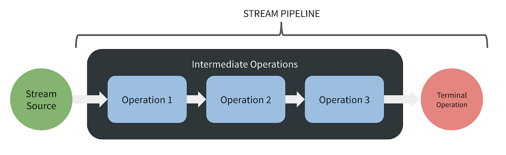
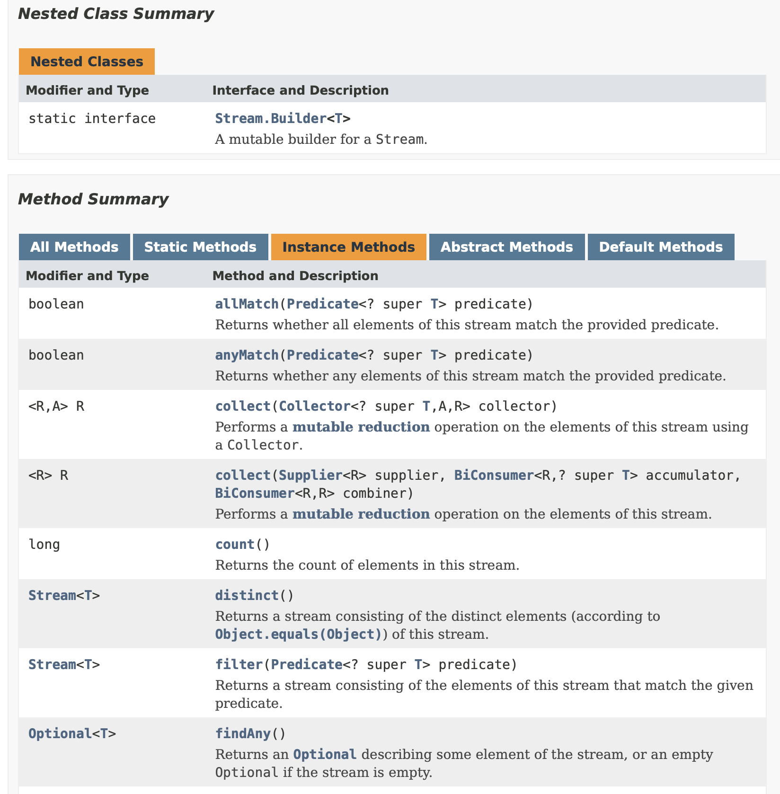

# Programación Funcional

Es un paradigma de desarrollo de software basado en funciones que no producen _efectos adversos_. Es decir, se trata de la ejecución en serie de _funciones puras_ cuyos resultados dependen únicamente de los parámetros de entrada. Este paradigma de desarrollo facilita la escritura lógica de código al desprender al desarrollador de la forma imperativa de construcción de algoritmos. Dicho de otra forma, nos permite enfocarnos en __qué queremos hacer__ y no en cómo queremos hacerlo.

Los programas funcionales están construidos por una serie de funciones compuestas que toman un argumento y retornan un valor, tan simple como eso. De esta forma, no nos interesa, realmente, lo que hay _adentro_ de dichas funciones porque, en teoría, no debería ocurrir ninguna situación adversa. De esta forma, una función es una caja negra que:

* Toma un argumento (__uno solo__).
* Realiza cosas "misteriosas" adentro, tales como alteración y procesamiento de variables, pero sin ningún efecto observable desde el exterior.
* Retorna un __único__ valor.

Que un programa no tenga efectos secundarios no es suficiente para que sea considerado "funcional". Un programa funcional no debe ser afectado por el mundo exterior, por lo que debe depender únicamente del argumento que reciba. En otras palabras, no debe depender de información extraída desde una consola, un archivo, una URL remota o una base de datos. Ni siquiera debería depender de variables globales en el sistema. 

## 1. Interfaz funcional

Se trata del contrato base con el que se construyen las relaciones funcionales en Java. Es una interfaz que contiene sólo un método abstracto,recibe un sólo parámetro de entrada y produce una sola respuesta.

```java
@FunctionalInterface
public interface Function<T, R> {
  R apply(T t);
}
```

Esta interfaz genérica es propia de `java.util.function`. A continuación, se explica cada una de las partes de este contrato:

* __`@FunctionalInterface`__: anotación base de Java que define la interfaz como _funcional_. Garantiza que la estructura el contrato sea propio de un algoritmo funcional.
* __`T`__: se trata del tipo de argumento de entrada. Puede ser un número (`int`, `double`, etc), una cadena de texto (`String`, `char` etc), o cualquier otro tipo de objeto, y se especifica en el momento en que se utiliza la función.
* __`R`__: se trata del argumento de respuesta y puede ser de cualquier tipo, dependiendo de lo que debería retornar la función.

Algunas de las interfaces derivadas más populares son: [`Consumer`](https://docs.oracle.com/javase/8/docs/api/java/util/function/Consumer.html) y [`Predicate`](https://docs.oracle.com/javase/8/docs/api/java/util/function/Consumer.html), que usaremos más adelante en el paradigma de programación reactiva para operaciones de comunicación y filtrado de datos, entre otras funcionalidades.

## 2. Función Lambda

Se trata de un método que implementa el método único definido en una interfaz funcional y tiene una sintaxis única. Por ejemplo, la siguiente interfaz funcional:

```java
Integer numeroMayor(Integer x, Integer y) {
    if (x > y) {
        return x;
    }
    return y;
}
```

Se puede reescribir como una lambda de la siguiente forma:

```java
(Integer x, Integer y) -> {
    if (x > y) {
        return x;
    }
    return y;
}
```

Como podemos observar, la lambda no tiene el nombre del método `numeroMayor` que habíamos definido en un principio. Por este motivo, las lambdas son conocidas también como _funciones anónimas_. Esta última expresión, puede incluso simpleficarse de una forma mucho más fácil de interpretar:

```java
(x, y) -> (x>y ? x:y);
```

Como se aprecia, las funciones lambda tampoco requieren especifciar la naturaleza de los parámetros de entrada o salida, lo que las convierte en funciones dinámicas dentro del ecosistema estático de Java. 

## 3. Concepto de `Streams`

Un _stream_ es una abstracción que se relaciona con una colección de datos (lista, conjunto, colección, etc). De manera informal, se puede concebir como un pipeline sobre el que transcurren todos los datos definidos en la colección. Las operaciones que ocurren dentro de este pipeline son dos tipos: _operaciones intermedias_ y _operacionales terminales_, como se aprecia en la Figura 1. 



Figura 1. Stream pipeline. __Fuente:__ [https://saileerenapurkar.medium.com/getting-started-with-streams-in-java-7008b8a366e7](https://saileerenapurkar.medium.com/getting-started-with-streams-in-java-7008b8a366e7).

Las primeras se utilizan para hacer transformaciones sencillas de los datos, mientras que las últimas se emplean para hacer

Un _stream_ es funcional en sí mismo. Lo que significa que no modifica su fuente al producir un resultado. El patrón que sigue un stream generalmente es el siguiente:

1. Se envía la colección de datos al stream.
2. Se activan las operaciones intermedias definidas (`filter`, `map`, etc).
3. Se recolectan los resultados de las operaciones ejecutadas.

### 3.1. Operaciones intermedias

Las operaciones intermedias retornan siempre un nuevo stream. Se diseñó de esta forma para permitir la continua transformación de datos a través de múltiples funciones. Existen diferentes tipos de operaciones habilitadas, por default, en Java. Algunas de ellas se muestran en la Figura 2.



Figura 2. Operaciones intermedias predefinidas en Java. __Fuente:__ [Oracle](https://docs.oracle.com/javase/8/docs/api/java/util/stream/Stream.html).

Para más información, se puede acceder a la [documentación oficial de Oracle](https://docs.oracle.com/javase/8/docs/api/java/util/stream/Stream.html), en la sección de __"Instance Methods"__. Como se aprecia en la Figura 2, no todas las operaciones retornan _streams_. Las que retornan otros tipos de datos se conocen como _"operaciones terminales"_, de las que hablaremos en mayor detalle en la siguiente sección.


### 3.2. Operaciones terminales

A diferencia de las _operaciones intermedias_, las operaciones terminales han sido diseñadas para proveer un resultado final. La lógica de procesamiento de este resultado depende, primero, de la necesidad lógica; y, en segunda medida, del tipo de operación terminal que se escoja. 

Tomemos como ejemplo una simple operación estadística. Supongamos que tenemos una colección de datos con las edades de nuestros clientes y necesitamos conocer el _promedio_ de sus edades para escoger una estrategia publicitaria, ya que no es lo mismo ejecutar una campaña que capte la atención de niños, adolescentes, adultos jóvenes o adultos mayores. Adicional, debemos filtrar a las personas menores de edad de nuestro estudio, ya que se ha demostrado que son las personas con menores tasas de consumo en nuestro negocio. De forma declarativa, el cálculo del promedio podría ser algo como lo siguiente:

```java
public static void main(String[] args) {
    Collection<Integer> edadesConsumidores = Arrays.asList(10,20,12,22,40,25,16,32);

    Double promedio = 0.0;
    Integer cantidad = 0;
    for (Integer edad : edadesConsumidores) {
        if (edad > 18) {
            promedio += edad;
            cantidad++;
        }
    }
    promedio = promedio/cantidad;

    Long promedioEdades = Math.round(promedio);

    System.out.println(promedioEdades);
}
```

El algoritmo sigue el siguiente orden lógico:

1. Se define la colección de datos.
2. Se itera sobre cada uno de las datos, sumando las edades registradas en la colección que cumplan el criterio de mayoría de edad.
3. Se calcula el promedio, con base en la siguiente relación matemática:


4. Se redondea la ecuación para dar un promedio de tipo número entero.
5. Se imprime el valor en consola (el resultado es: 28 años).

Ahora, ajustando el algoritmo anterior con _streams_ de programación funcional:

```java
public static void main(String[] args) {
    Collection<Integer> edadesConsumidores = Arrays.asList(10,20,12,22,40,25,16,32);

    OptionalDouble promedioEdades = edadesConsumidores.stream()
        .filter(edad -> edad > 18)
        .mapToInt(Integer::intValue)
        .average();
    
    System.out.println(Math.round(promedioEdades.getAsDouble()));
}
```

Como se aprecia, lo primero que hacemos es filtrar los datos de las edades que sean menores de 18 años (operación intermedia). Luego, convertimos todos los datos de `Integer` a `int` (operación intermedia), con el fin de habilitar operaciones matemáticas del `IntStream`. Finalmente, calculamos el promedio con `average` (operación terminal), dándonos la misma respuesta que su contraparte declarativa. De esta forma, la programación funcional simplificó el algoritmo original y lo hizo más legible. 