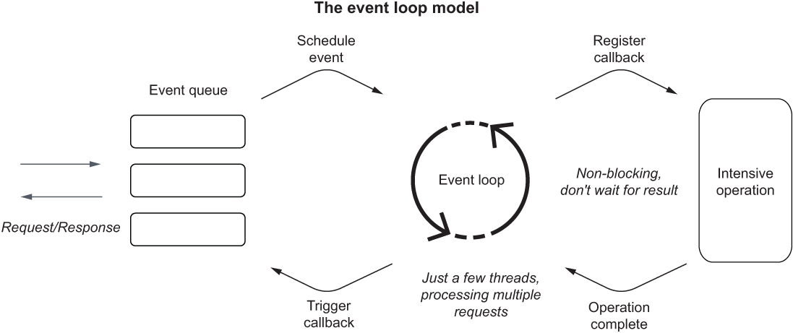

# Programación Reactiva

El paradigma de programación reactiva disminuye el consumo de los recursos computacionales durante operaciones I/O, mejora la escalabilidad e incrementa la relación costo-eficiencia durante la comunicación con bases de datos o servicios externos en los flujos de trabajo de una aplicación. Los microservicios que hemos construido hasta el momento han sido con flujos de trabajo síncrono, también conocidos como _"one thread-per-request model"_. Es decir, aplicaciones que sólo procesan una petición a la vez. Este enfoque es contrario a las aplicaciones reactivas, que operan de forma _asíncrona_ y de forma _no bloqueante_, disminuyendo el consumo de los recursos computacionales; lo que representa una gran ventaja en aplicaciones de tipo _cloud-native_, en donde se paga por el uso de estos recursos. 

En este paradigma, cuando un _thread_ envía una petición a un servicio backend, este no esperará a recibir una respuesta, sino que continuará con la ejecución de otras operaciones de forma _paralela_; eliminando así la dependencia lineal entre el número de _threads_ y el número de peticiones concurrentes, incrementando la escalabilidad de las aplicaciones. 

## 1. Arquitecturas asíncronas y _no bloqueantes_

La programación reactiva se basa en el paradigma conocido como _"event loop"_, que permite incrementar la concurrencia de peticiones dentro de un microservicio, sin depender estrictamente del número de _threads_. De hecho, una configuración por default de proyectos reactivos en Spring es el uso de un _thread_ por core de CPU. La base de este paradigma se puede evidenciar en la Figura 1.

Figura 1. Modelo _event-loop_. __Fuente:__ Vitale, T. _"Cloud Native Spring in Action"_. Manning.

Como se aprecia en la Figura 1, este modelo maneja los requests por threads que no se bloquean mientras esperan por una operación intensiva, lo que les permite procesar otros requests mientras tanto.

Una de las características esenciales de este tipo de aplicaciones es que proveen un _control de flujo_ que permite a los consumidores controlar la cantidad de datos que reciben. Lo que disminuye el riesgo de que los productores envíen más datos de lo que los consumidores podrían manejar. Evitando posibles ataques por DoS, que relantece las aplicaciones, genera fallas en cascada o que incluso repercute en una falla total del sistema.

### 1.1. Proyecto Reactor: streams reactivos con Mono y Flux

Reactive Spring está basado en el [Proyecto Reactor](https://projectreactor.io), un framework robusto para la generación de aplicaciones asíncronas y no-bloqueantes en el JVM (_Java Virtual Machine_). Conceptualmente, redefine el __Java Stream API__ (visto en el capítulo de [Programación Funcional](functional.md)) para definir el procesamiento de datos obtenidos de forma asíncrona. 

Los _streams_ reactivos operan de acuerdo al paradigma _producer/consumer_. El _producer_, como su nombre lo indica, es el que produce los datos que eventualmente estarán disponibles. Reactor provee dos APIs que emplean la interfaz `Producer<T>`: `Mono<T>` y `Flux<T>`.

* `Mono<T>`: representa un solo valor asíncrono. Es el equivalente al uso de `Optional<T>` en Java Stream.
* `Flux<T>`: representa una secuencia asíncrona de 0 o múltiples items. Es el equivalente al uso de `Collection<T>` en Java Stream.

Los posibles resultados de un stream reactivo son: un resultado vacío, un valor o un error. 

Los _consumer_ se conocen también como ___subscribers___. Esto debido a que se suscriben a un _producer_ y son notificados cuando los datos están disponibles. Como parte de la "suscripción", los _consumer_ notifican a los _producer_ sobre la cantidad de datos que pueden recibir y procesar en un tiempo dado. Esta es una funcionalidad poderosa que previene que los _consumer_ reciban una cantidad mayor de información a la capacidad que tienen para procesarlos; evitando una caída inesperada del microservicio. 

Es posible crear streams reactivos que combinen datos de diversas fuentes y los manipulen usando la vasta colección de operadores disponibles en el proyecto Reactor que son similares a los vistos en la sección de [Programación Funcional](functional.md), entre ellos: `map`, `filter` y `sort`, por nombrar algunos. 

Además, también cuenta con operadores propios que incrementan la resiliencia de la aplicación. Entre ellos se destacan: `retryWhen()` y `timeout()` que permiten definir límites lógicos durante la comunicación entre un _consumer_ y un _producer_. 

### 1.2. Entendiendo el stack de prorgamación reactiva

Cuando se construye una aplicación en Spring Boot, es posible elegir entre un _servlet stack_ y un _reactive stack_. El primero se basa en opearciones síncronas y bloqueantes que emplea en un modelo de tipo "thread-per-request". Por otro lado, el _reactive stack_ se basa en operaciones asíncronas y no-bloqueantes que emplea un modelo de tipo "event-loop" (ver Figura 1) para el manejo de las peticiones.

