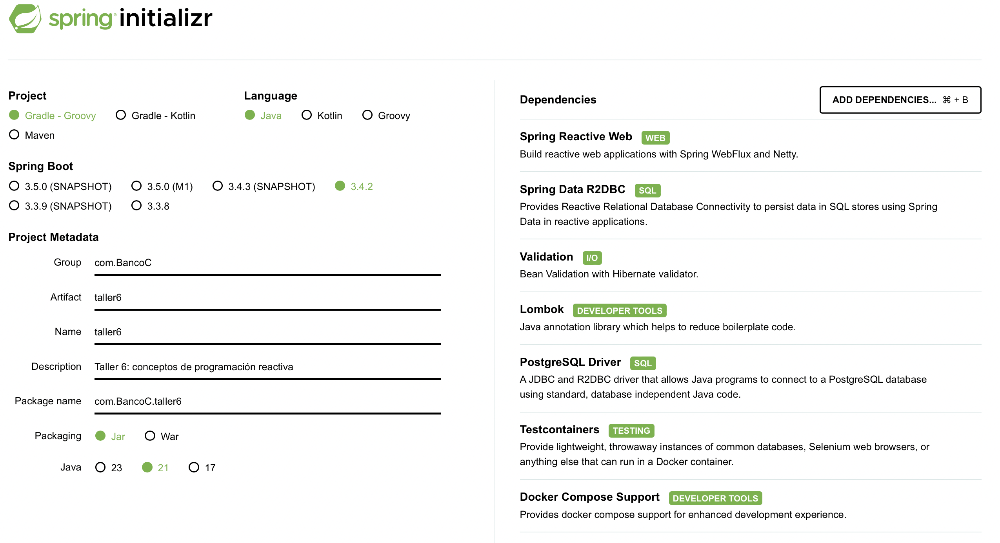

# Taller 9

Hasta este momento, hemos trabajado de forma imperativa con Spring MVC y Spring Data JPA. En el presente taller, aprenderemos sobre las generalidades de trabajar con Spring WebFlux y Spring Data R2DBC. Veremos que los patrones y principios que hemos aplicado hasta el momento los seguiremos usando en aplicaciones reactivas. La principal diferencia será que cambiaremos la implementación de la lógica de negocio de forma imperativa al uso de streams reactivos procesados de forma asíncrona. 

Para ello, usaremos como ejemplo lo construido en el [Taller 3](../../data/Talleres/taller3.md), donde definimos la lógica básica de un carrito de compras. 

## 1. Configuración del proyecto

En primer lugar, empezaremos por generar el proyecto base. Usaremos [Spring Initialzr](https://start.spring.io) con la configuración mostrada en la Figura 1.



Figura 1. Generación del proyecto con Spring Initialzr.

A continuación, se explican brevemente las dependencias principales:

* _Spring Reactive Web:_ provee las librerias necesarias para la construcción de aplicaciones web reactivas con Spring WebFlux y Netty como servidor embebido por default.
* _Spring Data R2DBC:_ importa las libererias base necesarias para la persistencia de datos relacionales de aplicaciones reactivas.
* _Validation:_ se emplea en procesos de validación. Basado en el Java Bean Validation API.

A continuación, configuraremos el servidor de aplicación Netty en el `application.yaml` de la siguiente forma:

```yaml
server:
  port: 8080                        1️⃣              
  shutdown: graceful                2️⃣          
  netty:
    connection-timeout: 2s          3️⃣            
    idle-timeout: 15s               4️⃣     
 
spring:
  application:
    name: carrito-compras
  lifecycle:
    timeout-per-shutdown-phase: 15s 5️⃣
```

1. Define el puerto en el que es posible acceder a la aplicación.
2. Habilita el _graceful shutdown_. Al recibir una solicitud de apagado, el sistema dejará de recibir nuevas peticiones, terminará de completar las peticiones que se encuentren en curso y liberará los recursos antes de proceder con el apagado.
3. Cantidad de tiempo que esperará el sistema para una conexión TCP que se establezca con el servidor.
4. Cantidad de tiempo a esperar antes de cerrar la conexión TCP en caso de que no se produzca la transferencia de datos.
5. Define un periodo de gracia de 15 segundos para cada periodo de apagado. Si demora más de este tiempo, Spring forzará el apagado de la aplicación.

## 2. Modelos

Antes de empezar a redefinir los modelos vistos en el [Taller 3](../../data/Talleres/taller3.md), iniciaremos por configurar la conexión a la base de datos. En primer lugar, iniciaremos por definir el `compose.yaml` para crear el contenedor con una base de datos PostgreSQL con Docker Compose:

```yaml
services:
  carrito-db:
    image: 'postgres:latest'
    environment:
      - 'POSTGRES_DB=taller9'
      - 'POSTGRES_PASSWORD=ejemplo123'
      - 'POSTGRES_USER=usuario'
    ports:
      - '5432'
```

Luego, ajustaremos el `application.yaml` para definir los parámetros de conexión a la base de datos.

```yaml
spring:
    r2dbc: 
        username: usuario                                    1️⃣
        password: ejemplo123                                 2️⃣
        url: r2dbc:postgresql://localhost:5432/taller9       3️⃣
        pool: 
            max-create-connection-time: 2s                   4️⃣
            initial-size: 5                                  5️⃣
            max-size: 10                                     6️⃣
```

1. Define el nombre de usuario definido.
2. Especifica la contraseña de conexión.
3. Protocolo y url de conexión a la base de datos de PostgreSQL.
4. Tiempo máximo de espera para establecer una nueva conexión con la base de datos.
5. Tamaño inicial del _pool_ de conexión. Garantiza que hayan, al menos, 5 conectores establecidos con la base de datos.
6. Cantidad máxima de conexiones mantenidas en le pool de conexión. Limita la cantidad máxima de conexiones concurrentes con la base de datos para evitar una sobrecarga.

Como se aprecia, estas configuraciones ayudan a incrementar el performance de una aplicación. 

### 2.1. Persistencia de datos

Además de la configuración mostrada anteriormente, R2DBC no genera ni actualiza los esquemas en bases de datos de forma automática, por lo que usaremos `FlyWay` como sistema de control de migración para el manejo de los esquemas en nuestra base de datos. Para configurarlo, sólo debemos asegurarnosde contar con la siguiente dependencia en el `build.gradle`.

```gradle
plugins {
	id 'java'
	id 'org.springframework.boot' version '3.4.2'
	id 'io.spring.dependency-management' version '1.1.7'
}

dependencies {
  ...,
  implementation 'org.flywaydb:flyway-core'
	implementation 'org.flywaydb:flyway-database-postgresql',
  ...
}
```

Además, configuraremos lo siguiente en el `application.yaml`.

```yaml
spring:
    profiles:
        active: dev                                     1️⃣
    lifecycle:
        timeout-per-shutdown-phase: 15s
    flyway: 
        user: ${spring.r2dbc.username}                  2️⃣                 
        password: ${spring.r2dbc.password}              3️⃣   
        url: jdbc:postgresql://localhost:5432/taller9   4️⃣
```

1. Definimos el ambiente activo durante el tiempo de ejecución; para este caso: `dev`. Lo que significa que usará la metadata definida con este `profile`.
2. Flyway necesita la configuración del usuario de la base de datos para acceder,
3. De la misma forma, necesita la contraseña para conectarse a la base de datos y configurar los esquemas.
4. Para la url de conexión, utiliza `jdbc`. 


### 2.2. Producto

FlyWay funciona como un sistema de control de versiones para la implementación de esquemas en bases de datos. Para usarla adecuadamente, sólo se requiere crear un archivo SQL en el siguiente path: `resources/db/migration`. El primer esquema puede tomar como nombre: `V1__producto.sql` (nota que __se debe usar dos raya-piso__), con el siguiente contenido:

```sql
CREATE TABLE Producto (
    producto_id     BIGSERIAL PRIMARY KEY NOT NULL,
    nombre          VARCHAR(255) NOT NULL,
    descripcion     TEXT,
    precio          FLOAT NOT NULL,
    inventario      INTEGER
);
```

Con base en este esquema, creamos la siguiente clase de Java:

import Tabs from '@theme/Tabs';
import TabItem from '@theme/TabItem';

<Tabs>
  <TabItem value="modelo-producto" label="Modelo" default>
    ```java
    @Table (name = "Producto")
    @Data
    @AllArgsConstructor
    @NoArgsConstructor
    @Builder
    public class Producto {

        @Id
        private Long productoId;

        private String nombre;
        private String descripcion;
        private Double precio;
        private Integer inventario;
    }
    ```
  </TabItem>
  <TabItem value="repositorio-modelo" label="Repositorio">
  ```java
  public interface ProductoRepository extends ReactiveCrudRepository<Producto, Long> {
    
  }
  ```
  
  En R2DBC, la definición de repositorios es bastante similar a la metodología en Spring Data JPA, donde el `ReactiveCrudRepository` actúa como un intermediario entre los objetos Java y los objetos en bases de datos.
  </TabItem>
</Tabs>

#### 2.2.1 Test unitarios

Para validar el correcto funcionamiento de la capa de persistencia, construiremos los siguientes test unitarios.

<Tabs>
  <TabItem value="general" label="GeneralTest">
```java
public class GeneralTest {

    protected Producto camisa;
    protected Producto pantalon;
    

    @BeforeEach
    public void setUp() {
        camisa = Producto.builder()
            .nombre("Camisa cuadros")
            .precio(100_000.0)
            .descripcion("Hermosa camisa de cuadros. ¡Compra ya!")
            .inventario(15)
            .build();

        pantalon = Producto.builder()
            .nombre("Pantalón cuero")
            .precio(1_000_000.0)
            .descripcion("Hermoso pantalón de edición limitada. ¡Compra ya!")
            .inventario(2)
            .build();
    }
    
}
```
  </TabItem>
  <TabItem value="config-test" label="ModelosTest">
```java
@DataR2dbcTest
@Testcontainers
@ActiveProfiles("test")
public class ModelosTest extends GeneralTest {

    @Autowired
    protected ProductoRepository repository;

    protected Producto camisaGuardada;

    @Container
    @ServiceConnection
    static PostgreSQLContainer<?> postgres =
        new PostgreSQLContainer<>("postgres:15");

    @Override
    @BeforeEach
    public void setUp() {
        super.setUp(); //=> importa objetos de pruebas

        camisaGuardada = repository.save(camisa).block();
    }

}
```
  </TabItem>
  <TabItem value="productos-test" label="ProductoTest">
```java
public class ProductoTest extends ModelosTest {

    @Test
    void createProducto() {
        assertEquals(camisaGuardada, camisa);
    }

    @Test
    void getProductos() {
        Producto pantalonComprado = repository.save(pantalon).block();

        StepVerifier
            .create(repository.findAll())
            .expectNextMatches(
                prenda -> this.comparacionProducto(prenda, camisaGuardada)
            )
            .expectNextMatches(
                prenda -> this.comparacionProducto(prenda, pantalonComprado)
            )
            .verifyComplete();
    }

    @Test
    void updateProducto() {
        camisaGuardada.setInventario(0);
        camisaGuardada.setPrecio(2_000_000.0);

        repository.save(camisaGuardada)
            .then(repository.findById(camisaGuardada.getProductoId()))
            .as(StepVerifier::create)
            .expectNextMatches(
                prenda -> prenda.getPrecio().equals(2_000_000.0)
                            && prenda.getInventario() == 0
            )
            .verifyComplete();
    }

    private Boolean comparacionProducto(Producto referencia, Producto producto) {
        return referencia.getProductoId() == producto.getProductoId()
            && referencia.getInventario() == producto.getInventario()
            && referencia.getNombre().equals(producto.getNombre())
            && referencia.getPrecio().equals(producto.getPrecio());
    }

}

```
  </TabItem>
</Tabs>

## 3. Servicios

En la capa de servicios, nos interesa permitir las operaciones definidas en la siguiente interfaz:

```java
public interface ProductoOperaciones {
    Mono<Producto> nuevoProducto(Producto producto);
    Flux<Producto> todosProductos();
    Mono<Producto> obtenerProducto(Long productoId);
    Mono<Producto> actualizarProducto(Long productoId, Producto updates);
    Mono<Void> eliminarProducto(Long productoId);
}
```

A continuación, se aprecia la lógica detrás de cada uno de estos métodos:

<Tabs>
  <TabItem value="producto-service" label="ProductoService">
```java
@Service
public class ProductoService implements ProductoOperaciones {

    private ProductoRepository repository;

    public ProductoService (ProductoRepository repository) {
        this.repository = repository;
    }

    @Override
    public Mono<Producto> nuevoProducto(Producto producto) {
        try {
            this.validaciones(producto);
        } catch(Exception exception) {
            return Mono.error(exception);
        }
        return repository.save(producto);
    }

    @Override
    public Flux<Producto> todosProductos() {
        return repository.findAll();
    }

    @Override
    public Mono<Producto> obtenerProducto(Long productoId) {
        return repository.findById(productoId);
    }

    @Override
    public Mono<Producto> actualizarProducto(Long productoId, Producto updates) {
        return this.obtenerProducto(productoId)
            .filter(producto -> producto != null && isUpdateValid(updates))
            .map(
                producto -> {
                    realizarUpdate(producto, updates);
                    return producto;
                }
            ).flatMap(this::nuevoProducto);
    }

    @Override
    public Mono<Void> eliminarProducto(Long productoId) {
        return repository.deleteById(productoId);
    }

    private void validaciones(Producto producto) throws Exception {
        if (producto == null) {
            throw new Exception("Datos inválidos: producto nulo");
        } else if (producto.getPrecio() == null) {
            throw new Exception("Debe tener un precio definido");
        } else if (producto.getPrecio() < 0) {
            throw new Exception("Alerta: no se admiten precios negativos");
        }
    }

    private void realizarUpdate(Producto productoBD, Producto updates) {
        productoBD.setPrecio(updates.getPrecio());
        productoBD.setInventario(updates.getInventario());
    }

    private Boolean isUpdateValid(Producto updates) {
        if (updates.getInventario() != null && updates.getInventario() < 0) {
            return false;
        } else if (updates.getPrecio() != null && updates.getPrecio() <= 0) {
            return false;
        }
        return true;
    }
    
}
```
  </TabItem>
  <TabItem value="service-tests" label="ProductoServiceTest">
```java
public class ProductoServiceTest extends ServiciosTest {
    
    @Test
    void nuevoProducto() {
        StepVerifier
            .create(productoOperaciones.nuevoProducto(camisa))
            .expectNextMatches(
                prenda -> this.verificacionProducto(camisaBD, prenda)
            )
            .verifyComplete();
    }

    @Test
    void nuevoProductoInvalido() {
        //Precio null
        camisa.setPrecio(null);
        StepVerifier
            .create(productoOperaciones.nuevoProducto(camisa))
            .expectErrorMatches(
                error -> error instanceof Exception &&
                         error.getMessage().equals("Debe tener un precio definido")
            )
            .verify();

        //Precio negativo
        camisa.setPrecio(-1_000.0);
        StepVerifier
            .create(productoOperaciones.nuevoProducto(camisa))
            .expectErrorMatches(
                error -> error instanceof Exception &&
                         error.getMessage().equals("Alerta: no se admiten precios negativos")
            )
            .verify();  

    }

    @Test
    void obtenerTodosProductosExistentes() {
        StepVerifier
            .create(productoOperaciones.todosProductos())
            .expectNextMatches(
                prenda -> verificacionProducto(camisaBD, prenda)
            )
            .expectNextMatches(
                prenda -> verificacionProducto(pantalonBD, prenda)
            )
            .verifyComplete();
    }

    @Test
    void obtenerProductoExistente() {
        StepVerifier
            .create(productoOperaciones.obtenerProducto(102L))
            .expectNextMatches(
                prenda -> prenda.equals(pantalonBD)
            )
            .verifyComplete();
    }

    @Test
    void obtenerProductoInexistente() {
        StepVerifier
            .create(productoOperaciones.obtenerProducto(100L))
            .expectNextCount(0)
            .verifyComplete();
    }

    @Test
    void actualizarProducto() {
        StepVerifier
            .create(productoOperaciones.actualizarProducto(
                102L, 
                Producto.builder()
                    .precio(500_000.0)
                    .inventario(10)
                    .build()
            ))
            .expectNextMatches(
                prenda -> verificacionProducto(pantalonActualizado, prenda)
            )
            .verifyComplete();
        
        verify(productoRepository, times(1)).save(pantalonActualizado);
    }

    @Test
    void actualizarProductoNoValido() {
        StepVerifier
            .create(productoOperaciones.actualizarProducto(
                102L,
                Producto.builder()
                    .inventario(-1)
                    .build()
            ))
            .expectNextCount(0)
            .verifyComplete();
    }

    @Test
    void eliminarProducto() {
        StepVerifier
            .create(productoOperaciones.eliminarProducto(102L))
            .expectSubscription()
            .verifyComplete();

        verify(productoRepository, times(1)).deleteById(102L);
    }

    private Boolean verificacionProducto(Producto referencia, Producto producto) {
        return referencia.getProductoId() > 0 &&
            referencia.getNombre().equals(producto.getNombre()) &&
            referencia.getInventario() == producto.getInventario() &&
            referencia.getDescripcion().equals(producto.getDescripcion());
    }
}
```
  </TabItem>
</Tabs>

