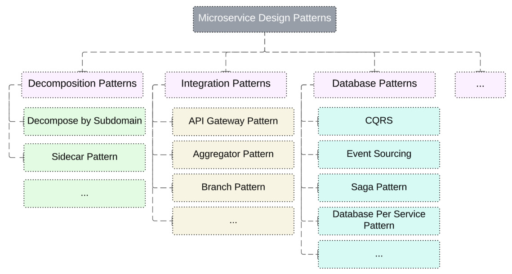
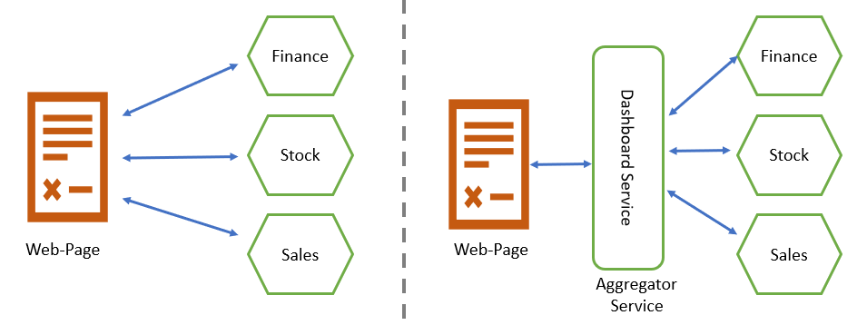
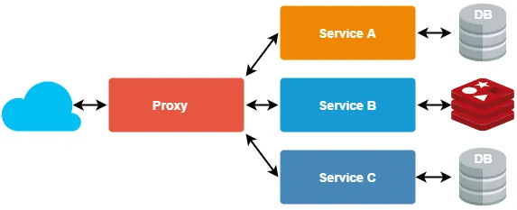
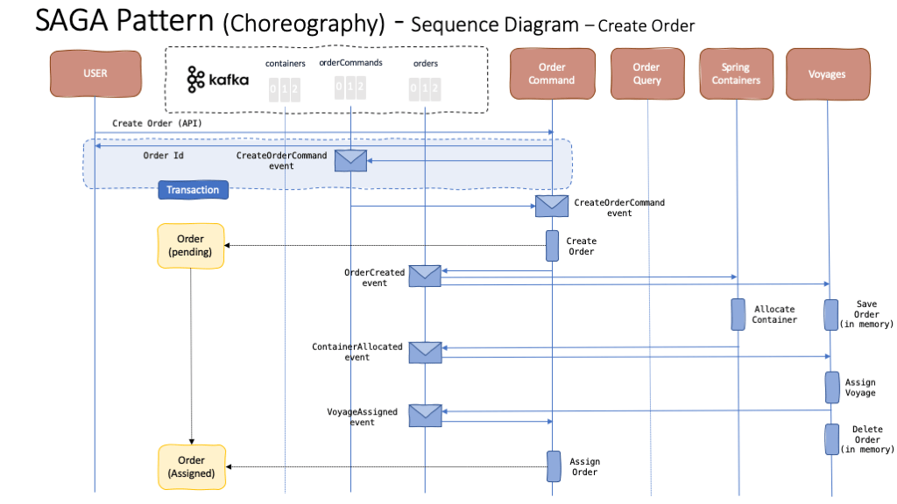
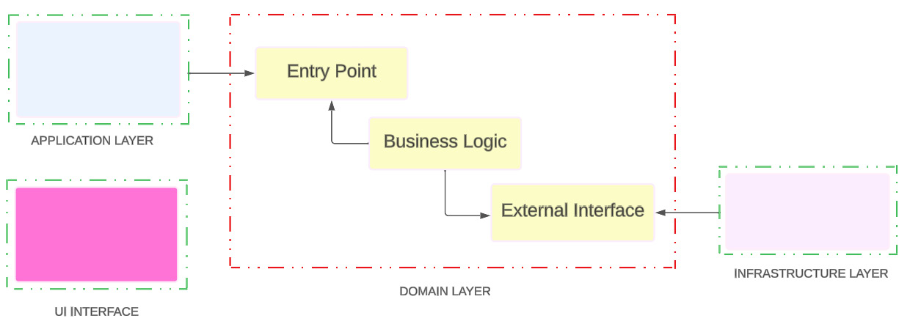
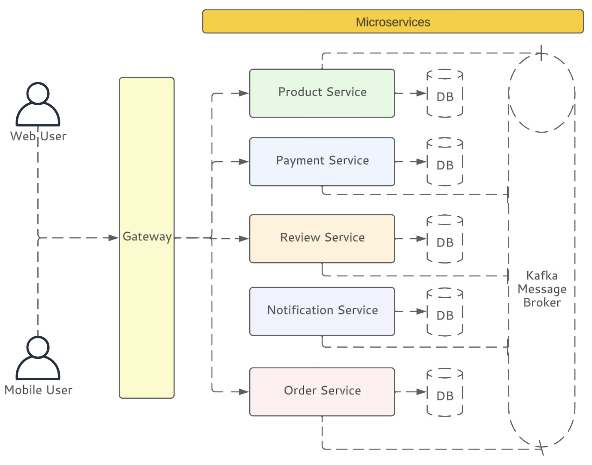

# Patrones de Arquitectura

Toda industria sopesa sus decisiones en dos grupos: _estrategia_ y _planificación_. La primera se centra en la __efectividad__, se acopla con las necesidades del negocio y busca incrementar el _revenue_ y las utilidades solucionando los problemas de los clientes. El segundo, se basa en la _eficiencia_, busca centrarse en ejecutar tareas sin preguntar el _porqué_ de las cosas y en planificar la secuencia de ejecución.

Es claro que el verdadero valor agregado está en el primer grupo, y de allí la importancia del presente capítulo. Los patrones de arquitectura de una solución definen el curso de la solución y su mantenibilidad en el tiempo. No existe una "receta única" que se acomode como la mejor solución para todos los problemas. Por lo que es importante conocer los principales patrones y, acorde a la necesidad, aplicarlos. 

## 1. Arquitectura de microservicios

Dentro de la industria de desarrollo de software, es común encontrar dentro de diferentes productos arquitecturas basadas en microservicios. Una arquitectura de este tipo busca dividir el problema de negocio en pequeños "servicios" independientes, donde cada uno se enfoca en hacer una tarea específica y comunicar sus resultados hacia otros servicios. El principal beneficio es que cada servicio es construido por un equipo de trabajo, lo que permite desarrollar soluciones en paralelo, acortando los tiempos de entrega de valor.

Esta separación hace que la aplicación sea altamente escalable y resiliente. Abierta a la posibilidad de reutilizar ciertas funcionalidades cada vez que sea necesario. Incrementa la resiliencia debido a que, al tener servicios desacoplados, la aplicación puede continuar operando aún si ocurre algún incidente en alguna funcionalidad específica.

### 1.1. Patrones de diseño

Existen diferentes patrones de microservicios que ayudan a mitigar el riesgo de falla en su operación. Algunos de ellos, se pueden apreciar en la Figura 1.

Figura 1. Patrones de diseño de microservicios. __Fuente:__ Ahmet Meric. _"Mastering Spring Boot 3.0"_. O'Reilly.

Una arquitectura de microservicios puede complicarse rápidamente debido a la flexibilidad y evolución de las demás partes, al mismo tiempo. Los patrones de diseño ayudan a mitigar ese riesgo para ciertos problemas específicos.

### 1.1.1 Aggregator design pattern

El _Aggregator pattern_ es útil cuando se necesita mostrar data de múltiples microservicios en una misma página o interfaz. Simplifica la integración entre servicios y provee una única interfaz para la interacción con el cliente, como se observa en la Figura 2.

Figura 2. Aggregator pattern. __Fuente:__ Sharma, Satish. _"Microservices Design Patterns Part 3: Patterns(Proxy, Aggregator)"_. LinkedIn Blog.

### 1.1.2 Proxy pattern

Se trata de una variación del _Aggregator pattern_. Evita la necesidad de exponer todos los servicios, por lo que, en su lugar, se expone un _service proxy_ que procesa la información proveniente de los otros microservicios. 

Figura 3. Proxy pattern. __Fuente:__ tsh.io

### 1.1.3 API Gateway design pattern

El API Gateway actúa como un punto de entrada hacia los microservicios. Todas las peticiones deben dirigirse hacia el API Gateway, en donde se establecen controles de autenticación, autorización, monitoreo y ruteo hacia los servicios de interés. Provee una capa de seguridad adicional para evitar exponer los servicios al internet.

Figura 4. API Gateway design pattern. __Fuente:__ Mehmet Ozkaya. _"API Gatewat Pattern"_. Medium.

### 1.1.4 Saga design pattern

Este patrón ayuda a soportar __largas transacciones__ que pueden dividirse en una collección de subtransacciones. Con microservicios, cada transacción actualiza los datos en un servicio, cada paso subsecuente, debe activarse al completar los pasos previos. Por ejemplo, al postear una foto en una red social, este patrón coordina el almacenamiento de la foto, actualización del perfil y notificación de seguidores. Todo al mismo tiempo.

En algunas implementaciones, se hace necesario que si alguna de las subtransacciones falla, debe ejecutarse un proceso de compensación que revierta los cambios. El patón Saga soporta dos tipos de implementación: _coreografía_ u _orquestación_.

Figura 5. Saga pattern (coreografía). __Fuente:__ IBM Garage: Event-Driven Reference Architecture.

## 2. Domain-Driven Design

DDD se trata de la forma en cómo se estructura el código de un proyecto alrededor del problema de negocio. En su forma más simple, se trata de organizar el código de tal forma que simplifique la construcción de una aplicación.

### 2.1. Terminología

DDD ronda alrededor del concepto del __dominio__, que se refiere al tema principal en el que se enfoca la aplicación. Por ejemplo, si se está construyendo una app de orden, el dominio podría ser _pedidos online_ o _procesamiento de una orden_. Una aplicación puede conciliarse como un grupo de _dominios_ que interactúan entre sí.

Cuando el dominio es demasiado grande, es necesario subdividirlo para simplificar su manejo, también conocido como __bounded contexts__. 

### 2.2. Definición de una estructura con DDD

Para entender la estructura de un DDD, tomaremos como ejemplo una plataforma de compras online. Hay algunas capas que son clave para hacer que una plataforma de estas características funcione de manera adecuada:

* En primera instancia, se debe tener una interfaz de usuario (__UI Layer__). Es lo que clientes ven al acceder a la plataforma en sus teléfonos móviles o en sus ordenadores.
* Debería existir una capa de aplicación, o __application layer__. Esta capa no debe tener ninguna lógica de negocio. Actúa como una guía para el usuario durante su interacción con la interfaz. 
* Ahora, hablaremos de la capa de dominio (__domain layer__), que se define como el alma y corazón de toda la operación. Contiene todos los conceptos del negocio, tales como usuarios, productos y órdenes, por mencionar algunos. Los servicios dentro de esta capa tienen comportamientos predefinidos que todo el mundo debe entender. Es la capa central y todas deben depender de ella.
* Finalmente, tenemos la capa de infraestructura (__infraestructure layer__), que facilita la comunicación entre todas las capas. 

De forma resumida, la _UI layer_ es la capa con la que los usuarios se comunican; la _application layer_ maneja las tareas; la _domain layer_ opera las funcionalidaddes del negocio; y la _infraestructure layer_ ayuda a todas las demás a comunicarse entre sí. La Figura 6 ilustra estas interacciones.

Figura 6. Relaciones entre capas en una arquitectura con DDD. __Fuente:__ Ahmet Meric. _"Mastering Spring Boot 3.0"_. O'Reilly.

En la Figura 7, se puede observar una arquitectura de microservicios definida con base en una arquitectura basada en DDD para una plataforma de comercio electrónico.

Figura 7. Servicios en una estructura DDD. __Fuente:__ Ahmet Meric. _"Mastering Spring Boot 3.0"_. O'Reilly.

## 3. Patrón CQRS

El patrón _"Command and Query Responsibility Segregation"_ (CQRS, por sus siglas en inglés) se trata de un patrón de diseño que busca separar las operaciones de escritura (_command_) de las de lectura (_query_). En algunas situaciones, esto puede ser ventajoso por la naturaleza misma de la aplicación o servicio. 

* Las operaciones de _escritura_ compete la creación, actualización y eliminación de registros. 
* Por otro lado, las operaciones de _lectura_ requiere la obtención de datos sin cambiar el estado de los mismos.

Es importante recordar que esta arquitectura es eficiente para ciertas necesidades, no para todas. Aplicar CQRS es útil cuando existe un desbalance entre las operaciones de escritura y lectura. Realizar esta separación permite el escalamiento independiente de las dos operaciones, facilita la adopción de prácticas de seguridad sobre quién puede manipular o leer los datos y permite la óptima configuración de esquemas para la lectura y manipulación de datos.
