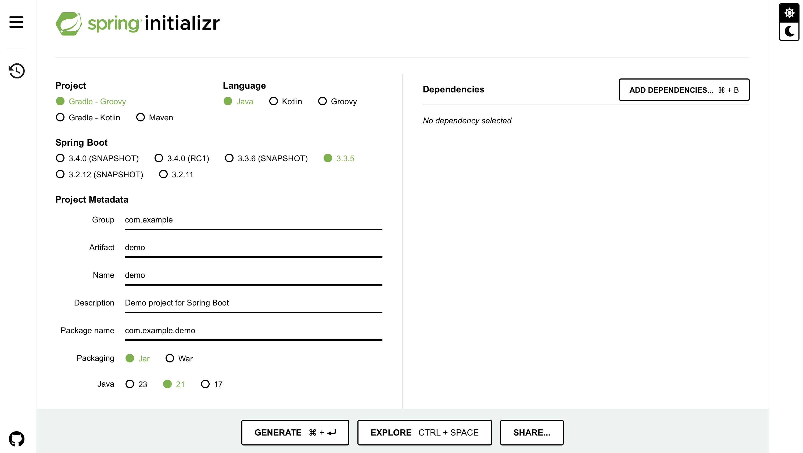

# Spring Boot: Conceptos base

Lo primero es entender cómo crear un proyecto de Spring Boot. La forma más sencilla de hacerlo es a través del proyecto gratuito conocido como __Spring Initializr__, que encontrarás en el [siguiente enlace](https://start.spring.io). 



Figura 8. Entorno de Spring Initializr. __Fuente:__ Spring Boot.

En la Figura 8 se puede aprecir el ecosistema de generación de proyectos de Spring Boot. Una interfaz web genérica que, a partir de cierta metadata de entrada, estructura el proyecto de Spring Boot con todas las dependencias y librerías que se requieran.

Una aplicación de Spring Boot convencional, creada a partir de la metadata definida en Spring Initializr (ver Figura 8), presenta la siguiente estructura, en términos de carpetas y archivos base que componen el proyecto.

```bash
/my_microservice
├── /src
│   ├── /main
|   |   ├── /java
|   |   |   ├── /Group-name/Artifact/Name
|   |   |   ├── {{Name}}Application.java
|   |   ├── /resources
|   |   |   ├── /static
|   |   |   ├── /templates
|   |   |   ├── application.properties
│   ├── /test
├── build.gradle
├── settings.gradle
```

Dentro de la carpeta `src` se encuentran todos los archivos que componen la aplicación. En la carpeta `java` se aloja el código fuente de nuestra aplicación; en `resources`, estarán los archivos de configuración; y en `test` estarán los test unitarios y de integración. En los archivos `build.gradle` y `settings.gradle` se encontrarán las dependencias y configuraciones base del proyecto.

## 1. Runner

Por default, Spring Boot está configurado para usar Apache Tomcat como servidor de aplicación. Para correr una aplicación de Spring Boot por default, sólo debes ir a la clase `{{Name}}Application.java` y ejecutarla. A continuación, se muestra un ejemplo de la clase _main_ general de una aplicación de Spring.

```java
package introduccion.taller1.taller1;

import org.springframework.boot.SpringApplication;
import org.springframework.boot.autoconfigure.SpringBootApplication;

@SpringBootApplication
public class Taller1Application {

	public static void main(String[] args) {
		SpringApplication.run(Taller1Application.class, args);
	}

}
```

Como se puede observar, la clase `Taller1Application` tiene el clásico método estático con el que se corren las aplicaciones Java convencionales. Adicional, tiene el decorador `@SpringBootApplication`, que se trata de un __Bean__ que simplifica la lógica de configuración de la aplicación.

## 2. Beans

En Spring Boot, el concepto de _Bean_ se refiere a un tipo de decorador propio de Spring Framework que orquesta diferentes objetos para el funcionamiento de una aplicación. Funciona con base en el sistema de inversión de dependencias de Spring Framework (conocido como __Spring IoC__). Cuando creas una clase en una aplicación de Spring Boot y deseas que el Spring IoC maneje el ciclo de vida de los objetos (creación, inyección de dependencias y destrucción), lo instancias como un _bean_.

Existen diferentes tipos de _Beans_ para establecer configuraciones generales en un proyecto de Spring Boot. Algunos de los más comunes son:

* __`@Component`__: instancia un objeto de forma automática en el momento en que se inicia una aplicación de Spring Boot. Por ejemplo:

```java
import org.springframework.stereotype.Component;

@Component
public class MyService {
    public void sayHello() {
        System.out.println("Hello from MyService Bean!");
    }
}
```

De esta forma, creará un objeto de tipo `MyService` con un método público `sayHello`.

* __`@Repository`__: emplea objetos tipo DAO (_Database Access Objects_) para serializar los objetos obtenidos con bases de datos y viceversa.

* __`@Service`__: es un _bean_ derivado de `@Component` que hace referencia a una clase con __lógica de negocio__. Es especialmente útil al utilizar patrones de arquitectura hexagonal. Facilita la inyección de _beans_ tipo `@Repository` para integrar la lógica de negocio con la información almacenada en bases de datos. Por ejemplo:

```java
import org.springframework.stereotype.Service;

@Service
public class UserService {
    public String getUser() {
        return "John Doe";
    }
}
```

* __`@Controller`__ y __`@RestController`__: se emplean para la 

### 2.1. Inyección de dependencias

La inyección de dependencias es un concepto en la ingeniería de software agnóstico a los lenguajes de programación. Constituye la base con la que se relacionan diferentes objetos. Spring Boot simplifica estas relaciones mediante _beans_, donde se puede aplicar la inyección de dependencias a través del decorador __`@Autowired`__, o simplemente a través del constructor de la clase. Por ejemplo, para la relación de un objeto servicio con un controlador, sería algo así:

```java
package com.example.controllers;

import com.example.models.User;
import com.example.services.UserService;
import org.springframework.web.bind.annotation.GetMapping;
import org.springframework.web.bind.annotation.PathVariable;
import org.springframework.web.bind.annotation.RequestMapping;
import org.springframework.web.bind.annotation.RestController;

import java.util.List;

@RestController
@RequestMapping("/api/users")
public class UserController {

    private final UserService userService;

    // Constructor-based dependency injection
    public UserController(UserService userService) {
        this.userService = userService;
    }

    /**
     * GET /api/users
     * Return a list of all users.
     */
    @GetMapping
    public List<User> getAllUsers() {
        return userService.getAllUsers();
    }

    /**
     * GET /api/users/{id}
     * Return a single user by ID.
     */
    @GetMapping("/{id}")
    public User getUserById(@PathVariable Long id) {
        return userService.getUserById(id);
    }
}
```
