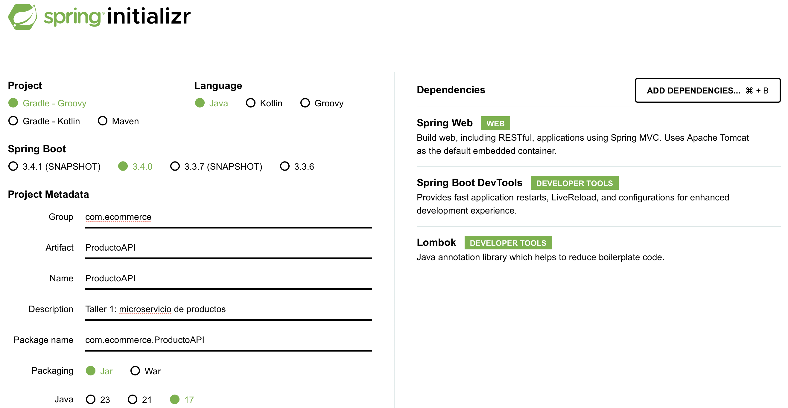

# Taller 1

Para hacerlo práctico, vamos a orientar este primer taller hacia la construcción de un microservicio de productos básico de una plataforma de e-commerce, donde aplicaremos los conceptos vistos en el capítulo anterior.

## 1. Objetivos

Al finalizar el ejercicio, deberíamos haber construído una API funcional en local que:

* Obtenga TODOS los productos - `GET api/products`
* Obtenga UN sólo producto - `GET api/products/{id}`
* Cree un nuevo producto - `POST api/products`
* Modifique un producto actual - `PUT api/products/{id}`
* Borre un producto - `DELETE api/products/{id}`

## 2. Habilidades aprendidas

Al finalizar el ejercicio, deberíamos saber cómo:

1. Crear y correr una aplicación de Spring Boot.
2. Utilizar __modelos__ para la representación de los datos.
3. Emplear __servicios__ para el manejo de la lógica de negocio.
4. Usar REST endpoints (GET, POST, PUT y DELETE) a través de __controladores__.
5. Conocer el concepto de _beans_ e __inyección de dependencias__.

## 3. Prerrequisitos

* JDK 17+.
* Gradle
* Postman

Para la generación del proyecto, usaremos [Spring Initializr](https://start.spring.io). En la siguiente imagen, observarás la configuración general que se recomienda seguir.



Figura 8. Data del proyecto.

Como se aprecia en la Figura 8, adicional a la metadata, también se han especificado algunas dependencias base, entre ellas:

* __Spring Web__: contiene las bases para la construcción de REST APIs y Apache Tomcat para correr el microservicio.
* __Spring Boot DevTools__: trae consigo herramientas que mejoran la experiencia de desarrollo.
* __Lombok__: facilita la construcción de POJOs (modelos de datos). 

La estructura objetivo de este taller debería ser lo siguiente:

```bash
src/
  main/
    java/
      com/
        ecommerce/
          ProductoApiApplication.java   <-- Ejecución del proyecto
          controllers/
            ProductController.java      <- @RestController
          services/
            ProductService.java         <-- @Service (lógica de negocio)
          models/
            Product.java                <-- POJO (data model)
    resources/
      application.properties            <-- Archivo de configuración (opcional)

```

## 4. Definición de Modelos

Los modelos de datos permiten la serialización de los objetos con respecto a la inforamción obtenida en bases de datos y viceversa. Para los objetos de tipo `Product`:

```java
package com.ecommerce.models;

import lombok.AllArgsConstructor;
import lombok.Data;
import lombok.NoArgsConstructor;

@Data
@AllArgsConstructor
@NoArgsConstructor
public class Product {
    private Long id;
    private String name;
    private String description;
    private Double price;
    private Integer quantity;
}
```

La clase `Product` es una clase POJO convencional, simplificada con la dependencia de __Lombok__. Los decoradores simplifican la creación de ciertos métodos y constructores de la clase.

* `@Data`: genera los _getters_, _setters_y el método `toString()` de los objetos.
* `@AllArgsConstructor`: define un constructor con todos los atributos del objeto.
* `@NoArgsConstructor`: define un constructor para crear un objeto _vacío_.

## 5. Servicio del Producto

La capa de servicios (`services`) contiene la lógica de negocio, que en este caso, compete a las operaciones CRUD (_Create, Read, Update and Delete_). 

```java
package com.ecommerce.services;

import com.ecommerce.models.Product;
import org.springframework.stereotype.Service;

import java.util.ArrayList;
import java.util.List;
import java.util.Optional;

@Service
public class ProductService {

    // In-memory product list (acts as a "database" for now)
    private final List<Product> products = new ArrayList<>();

    // Seed with some products
    public ProductService() {
        products.add(new Product(1L, "Laptop", "High-end gaming laptop", 1200.00, 5));
        products.add(new Product(2L, "Smartphone", "Latest smartphone with 5G", 800.00, 10));
        products.add(new Product(3L, "Headphones", "Noise-cancelling headphones", 150.00, 20));
    }

    // Get all products
    public List<Product> getAllProducts() {
        return products;
    }

    // Get a product by ID
    public Optional<Product> getProductById(Long id) {
        return products.stream().filter(product -> product.getId().equals(id)).findFirst();
    }

    // Add a new product
    public Product addProduct(Product product) {
        product.setId((long) (products.size() + 1)); // Auto-generate an ID
        products.add(product);
        return product;
    }

    // Update an existing product
    public Optional<Product> updateProduct(Long id, Product updatedProduct) {
        Optional<Product> productOptional = getProductById(id);
        productOptional.ifPresent(product -> {
            product.setName(updatedProduct.getName());
            product.setDescription(updatedProduct.getDescription());
            product.setPrice(updatedProduct.getPrice());
            product.setQuantity(updatedProduct.getQuantity());
        });
        return productOptional;
    }

    // Delete a product by ID
    public boolean deleteProduct(Long id) {
        return products.removeIf(product -> product.getId().equals(id));
    }
}

```

Para simplicidad de este ejercicio, no generamos una base de datos. Por ende, definimos una lista de productos dentro del constructor del servicio emulando los datos obtenidos por parte de una base de datos.

## 6. Controlador de Productos

Dentro del controlador, se definen las APIs que se exponen del microservicio. Para este caso:

```java
package com.ecommerce.controllers;

import com.ecommerce.models.Product;
import com.ecommerce.services.ProductService;
import org.springframework.web.bind.annotation.*;

import java.util.List;
import java.util.Optional;

@RestController
@RequestMapping("/api/products")
public class ProductController {

    private final ProductService productService;

    public ProductController(ProductService productService) {
        this.productService = productService;
    }

    // 1️⃣ GET /api/products - Get all products
    @GetMapping
    public List<Product> getAllProducts() {
        return productService.getAllProducts();
    }

    // 2️⃣ GET /api/products/{id} - Get a product by ID
    @GetMapping("/{id}")
    public Optional<Product> getProductById(@PathVariable Long id) {
        return productService.getProductById(id);
    }

    // 3️⃣ POST /api/products - Add a new product
    @PostMapping
    public Product addProduct(@RequestBody Product product) {
        return productService.addProduct(product);
    }

    // 4️⃣ PUT /api/products/{id} - Update a product by ID
    @PutMapping("/{id}")
    public Optional<Product> updateProduct(@PathVariable Long id, @RequestBody Product updatedProduct) {
        return productService.updateProduct(id, updatedProduct);
    }

    // 5️⃣ DELETE /api/products/{id} - Delete a product by ID
    @DeleteMapping("/{id}")
    public boolean deleteProduct(@PathVariable Long id) {
        return productService.deleteProduct(id);
    }
}
```

En esta sección, observamos múltiples decoradores que definen la funcionalidad de nuestra API. A continuación, se resume el significado de ellos:

* __`@RestController`__: define que el objeto se trata de un controlador REST.
* __`@RequestMapping("/api/products")`__: define el endpoint general. Es de carácter _opcional_.
* __`@GetMapping`__: define la lógica GET en el endpoint `/api/products`.
* __`@PostMapping`__: define la lógica POST en el endpoint `/api/products`.
* __`@PathVariable`__: identifica los argumentos del endpoint (`/api/products/{id}`) y lo asigna, como argumento de entrada, a la variable especificada en el método.
* __`@RequestBody`__: asigna el contenido del _body_ en peticiones tipo POST y PUT.