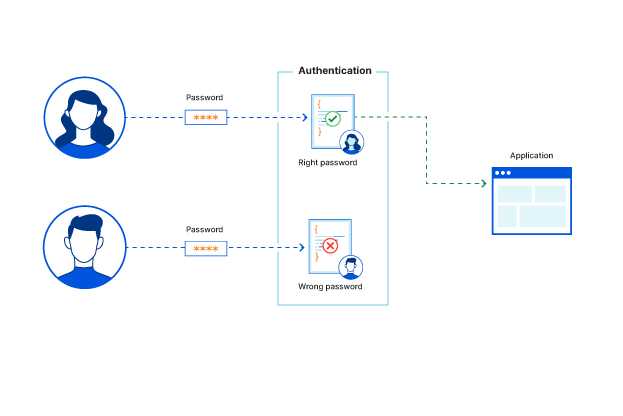
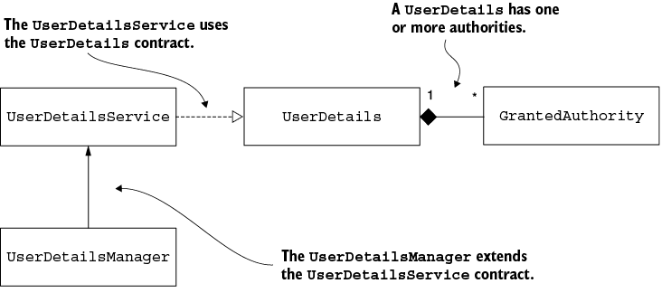
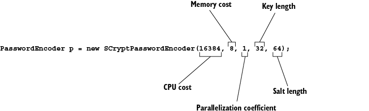
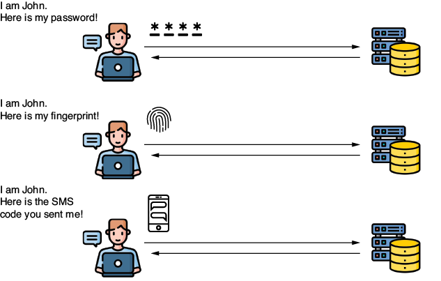

# Autenticación

En su forma más elemental, Spring Security funciona como un filtro. El microservicio recibe las credenciales de un usuario, valida si son correctas, ya sea contra en una base de datos, un caché o contra un servicio de autenticación externo. Luego, revisa si el usuario tiene los permisos para realizar la acción que solicita y, de tenerlos, permite continuar con el flujo lógico de negocio. Si no los tiene, o las credenciales (usuario/contraseña) no son válidas, deniega el acceso. Lo anterior, se puede apreciar de forma gráfica en la Figura 1.



Figura 1. Lógica de autenticación. __Fuente:__ [Cloudflare](https://www.cloudflare.com/learning/access-management/what-is-authentication/)

En el presente capítulo, aprenderemos sobre cómo se establecen estas configuraciones y la metodología básica de trabajo en Spring Security tomando como ejemplo el protocolo de __basic authentication__.

## 1. Protocolo de Autenticación

El proceso de autenticación se divide en dos secciones principales: manejo de _usuarios_ y de _contraseñas_. A continuación, podremos observar la configuración base definida en un proyecto con Spring Security.


Figura 2. Flujo básico funcional con Spring Security. __Fuente:__ Spilca, L. _"Spring Security in Action"_. Second Edition. O'Reilley.

Como se aprecia en la Figura 2, el proceso inicia con el _request_ de un usuario (en donde se envían sus credenciales). Allí, entran en acción diferentes componentes pre-configurados por Spring Security, cada uno descrito a continuación:

1. El `Authentication Filter` delega el proceso de autenticación al `Authentication Manager` y, basado en su respuesta, configura el _security context_.
2. El `Authentication Manager` usa al `Authentication Provider` para realizar la autenticación. Se emplea de esta forma porque el proveedor de autenticación puede ser interno (creado por nosotros) o externo (por ejemplo: Google, GitHub, etc).
3. Por su lado, el `Authentication Provider` ejecuta la lógica de autenticación.
4. El `User Details Service` obtiene las credenciales del usuario, ya sea desde una base de datos, un caché o un proveedor externo.
5. El `Password Encoder` se encarga de la codificación de la contraseña. Se emplea ya sea para almacenar una contraseña o para desencriptarla.
6. Con el usuario y la contraseña (desencriptada), se procede a realizar la comparación y concluir si el usuario es verídico; acorde a la lógica de autenticación.
7. Una vez validada y aprobada, el _security context_ almacena temporalmente las credenciales para la ejecución de los flujos del negocio; es decir, hasta que la aplicación de la respuesta esperada por el usuario.

Para lograr el proceso de autenticación descrito en la Figura 2, Spring Security requiere que el cliente envíe las credenciales del usuario (username/password) a través del `Authorization` header. En el valor del header, el cliente debe añadir el valor `Basic`, seguido del usuario y contraseña, codificados con `Base64` y separados por `:`. 

## 2. Manejo de Usuarios

Iniciaremos nuestro recorrido con el manejo de usuarios. Como se aprecia en la Figura 2, existen diferentes interfaces (contratos) que definen la arquitectura base de autenticación y se pueden apreciar en la Figura 3.



Figura 3. Dependencias base para el manejo de usuarios. __Fuente:__ Spilca, L. _"Spring Security in Action"_. Second Edition. O'Reilley.

A continuación, se explican cada uno de estos contratos.

* __`GrantedAuthority`:__ hace referencia a los roles adoptados por el usuario. Cada uno de ellos puede tener múltiples _permisos_ que definen la forma en cómo interactúa un usuario con la aplicación y qué acciones puede ejecutar. Se explica en detalle en el __capítulo 2__.
* __`UserDetails`:__ define el modelo base de usuarios.
* __`UserDetailsService`:__ especifica la forma en cómo se carga la información de un usuario.
* __`UserDetailsManager`:__ especifica las operaciones de adición, modificación o eliminación de un usuario.


### 2.1 Entendiendo `UserDetails`

Esta interfaz consiste en lo siguiente:

```java
public interface UserDetails extends Serializable {
  String getUsername();                                        ①
  String getPassword();
  Collection<? extends GrantedAuthority> getAuthorities();     ②
  boolean isAccountNonExpired();                               ③
  boolean isAccountNonLocked();
  boolean isCredentialsNonExpired();
  boolean isEnabled();
}
```

1.  Contiene las credenciales del usuario.
2.  Define los roles de nuestros usuarios.
3.  Establece posibles configuraciones que restringen o bloquean al usuario, para evitar problemas de suplantación de identidad en el futuro. Son argumentos opcionales y dependen de la lógica de negocio que se requiere implementar. Si alguno de ellos retorna `false`, el usuario no podrá interactuar con la aplicación y responderá con HTTP 401.

### 2.2. ¿Cómo funciona el `UserDetailsService`?

Este contrato únicamente informa la manera de cargar la información de un usuario mediante `username`, como se aprecia a continuación. 

```java
public interface UserDetailsService {
  public UserDetails loadUserByUsername(String username) 
    throws UsernameNotFoundException;
}
```

Se puede implementar en un servicio para especificar la lógica de carga del usuario, que puede variar si proviene de una base de datos relacional, NoSQL, caché o un microservicio externo.

### 2.3. Implementando `UserDetailsManager`

Como se aprecia en la Figura 3, este contrato __extiende__ las funcionalidades definidas por el `UserDetailsService`. Permite especificar la forma en cómo se crean, actualizan o eliminan usuarios, entre otras funcionalidades. 

```java
public interface UserDetailsManager extends UserDetailsService {
  void createUser(UserDetails user);
  void updateUser(UserDetails user);
  void deleteUser(String username);
  void changePassword(String oldPassword, String newPassword);
  boolean userExists(String username);
}
```

Este contrato se puede implementar en otro servicio customizado que especifique las funcionalidades de estos métodos para garantizar la persistencia de los datos.

## 3. Manejo de Contraseñas

El manejo de contraseñas es una parte esencial dentro del flujo de autenticación. En la presente sección, hablaremos del contrato de `PasswordEncoder` y las herramientas ofrecidas en el módulo de Spring Security Crypto (SSCM). 

### 3.1 Uso de `PasswordEncoder`

De la misma forma en como observarmos en la sección 1.1., también es posible customizar la forma en cómo se codifica o encripta una contraseña. Paso fundamental, ya que, bajo ninguna circunstancia, se debe almacenar una contraseña en texto plano. Empezaremos por entender las bases del contrato:

```java
public interface PasswordEncoder {

  String encode(CharSequence rawPassword);

  boolean matches(CharSequence rawPassword, String encodedPassword);

  default boolean upgradeEncoding(String encodedPassword) { 
    return false; 
  }
}
```
Las dos primeros métodos corresponden a la funcionalidad base de este contrato. `encode()` se encarga de codificar la contraseña, mientras que `matches()` verifica que una contraseña en texto plano corresponda a la contraseña codificada. 

Si bien es posible definir la funcionalidad base de estos métodos, acorde a las necesidades de seguridad del negocio, también es posible reusar algunas implementaciones pre-definidas del `PasswordEncoder`:

* `NoOpPasswordEncoder`: se trata de una opción deprecada que almacena la contraseña en texto plano. Se usa, normalmente, cuando no se desea corroborar la lógica de encriptamiento. __No se debe usar en ambientes productivos__.
* `StandardPasswordEncoder`: emplea SHA-256 para codificar las contraseñas. Está deprecada en las últimas versiones de Spring Security porque ya no se considera un estándar de codificación robusto en la industria. Se hace mención porque podría seguir estando implementado en algunos software legados con versiones antiguas de Spring Boot. Se recomienda actualizarlo a otro tipo de codificador.
* `Pbkdf2PasswordEncoder`: implementa el algoritmo de codificación [PBKDF2](https://cryptobook.nakov.com/mac-and-key-derivation/pbkdf2). Si bien es un estándar robusto para algunas aplicaciones, es importante tener en cuenta sus [limitaciones con autenticación LDAP](https://www.ibm.com/docs/es/sdse/6.4.0?topic=limitations-pbkdf2-password-encryption-algorithm).
* `BCryptPasswordEncoder`: emplea el robusto estándar [bcrypt](https://www.skysnag.com/es/blog/what-is-bcrypt/) para codificar la contraseña.
* `SCryptPasswordEncoder`: usa una técnica de [scrypt hashing](https://www.cryptominerbros.com/es/blog/what-is-scrypt-algorithm/?srsltid=AfmBOorE5jn8BFxuzjS1xllOCrXncqgl-IPttwbKog0ghu_AXd1y-vak) para codificar la contraseña.

Cada de una de estas implementaciones requiere de diversos secretos y configuraciones para la correcta generación del codificador de contraseñas. Por ejemplo, para implementar el algoritmo PBKDF2,sería algo como:

```java
PasswordEncoder encoder = 
   new Pbkdf2PasswordEncoder("secret", 16, 310000, Pbkdf2PasswordEncoder.SecretKeyFactoryAlgorithm.PBKDF2WithHmacSHA256);
```

Los primeros tres parámetros corresponden al valor de la llave usada para codificar el proceso, el número de iteraciones usada para codificar la contraseña y el tamaño del hash. El cuarto parámetro define el ancho del hash y se puede elegir alguna de las siguientes opciones:

* PBKDF2WithHmacSHA1
* PBKDF2WithHmacSHA256
* PBKDF2WithHmacSHA512

Entre mayor sea el hash generado, más segura será la contraseña codificada, pero menor será el _performance_ de la autenticación. De forma similar, en la Figura 4 se pueden apreciar los argumentos usados para el _scrypt hashing_.



Figura 4. Argumentos para implementar el _scrypt hashing_. __Fuente:__ Spilca, L. _"Spring Security in Action"_. Second Edition. O'Reilley.

### 3.2 Uso de Spring Security Crypto Module - SSCM

El módulo crypto (SSCM) es la parte de Spring Security que se encarga de toda acción relevante a criptografía, entre ellas: funciones de encriptamiento, decriptamiento y generación de llaves. 

En primer lugar, es importante entender que existen dos contratos para la generación de llaves: `StringKeyGenerator` y el `BytesKeyGenerator`.

```java
public interface StringKeyGenerator {

    String generateKey();

}
```

Los dos cuentan con el método `generateKey()`, que genera una llave de 8 bytes para encriptar o desencriptar un texto.

De igual forma, existen dos encriptadores en SSCM: `TextEncryptor` y el `BytesEncryptor`. Si bien funcionan de manera similar, las llaves que procesan son diferentes; de forma que el `TextEncryptor` sólo puede procesar llaves de tipo `String`, generadas con el `StringKeyGenerator`. Mientras que el `BytesEncryptor` puede procesar `bytes[]` o `String`.

```java
public interface TextEncryptor {

  String encrypt(String text);
  String decrypt(String encryptedText);

}
```

Los dos encriptadores cuentan con métodos para encriptar (`encrypt`) y desencriptar (`decrypt`) la información. Se puede emplear como estrategia adicional de seguridad para encriptación _simétrica_ o _asimétrica_ de contraseñas o información del usuario en general.

## 4. Implementaciones de Autenticación

Como se aprecia en la Figura 2, la lógica de autenticación se implementa en el `AuhtenticationProvider`, que es donde se encuentran las condiciones e instrucciones que deciden si se autentica un request. La entidad que delega esta responsabilidad al `AuthenticationProvider` es el `AuthenticationManager`, el cual recibe el request desde la capa de cadena de filtros HTTP (vistos en el capítulo de [Filtros de seguridad](./filtros.md)). El proceso de autenticación tiene sólo dos posibles resultadods:

1. _La entidad que hace el request no está autenticada_, en cuyo caso quiere decir que no se reconoce alusuario y que la aplicación rechaza el request sin delegar al proceso de autorización. Respondiendo con un HTTP 401 (Unauthorized).
2. _La entidad que hace el request está autenticada_. Los detalles de dicha entidad son almacenados dentro de la aplicación (en el `SecurityContext`) y pueden ser empleados para procesos de autorización. 

### 4.1. Entendiendo el `AuthenticationProvider`

En aplicaciones empresariales, es común encontrarnos en situaciones donde la implementación por default de Spring Security (mediante `username` y `password`) no aplica. Incluso, puede ser común encontrar muchas situaciones donde se necesiten aplicar múltiples protocolos de autenticación. Por ejemplo, se podría requerir aplicar un protocolo de autenticación multi-factor (MFA, por sus siglas en inglés) en donde el usuario reciba un mensaje de texto con un código de seguridad. O se podría requerir, por ejemplo, implementar autenticación biométrica con huella dactilar o reconocimiento facial, como se muestra en la Figura 4.



Figura 4. Ejemplos de protocolos de autenticación. __Fuente:__ Spilca, L. _"Spring Security in Action"_. Second Edition. O'Reilley.

Spring Security provee una serie de implementaciones que son útiles para muchos escenarios, pero no para todos. Debido a ello, este framework provee el contrato de `AuthenticationProvider` que permite la customización de cualquier lógica de autenticación. 

#### 4.1.1 Representación del request durante la autenticación

Para entender en detalle cómo se establece una lógica de autenticación, debemos entender, primero, cómo describir el _evento de autenticación_. 

`Authentication` es uno de los contratos principales involucrados en el el proceso de autenticación. Esta interfaz representa el evento de autenticación y contiene los detalles de la entidad que solicita acceder a la aplicación. Esta información es posible accederla durante y después del proceso de autenticación. 

El usuario que hace la petición de acceso a una aplicación se conoce como `Principal`, de la cual se basa el contrato de `Authentication`, como se muestra a continuación. 

import Tabs from '@theme/Tabs';
import TabItem from '@theme/TabItem';

<Tabs>
  <TabItem value="imagen-auth" label="Esquema de Authentication" default>
  

  Figura 5. Relación entre `Principal` y `Authentication`. __Fuente:__ Spilca, L. _"Spring Security in Action"_. Second Edition. O'Reilley.
  </TabItem>
  <TabItem value="interfaz-auth" label="Interfaz de Authentication">
```java
public interface Authentication extends Principal, Serializable {

  Collection<? extends GrantedAuthority> getAuthorities();
  Object getCredentials();
  Object getDetails();
  Object getPrincipal();
  boolean isAuthenticated();
  void setAuthenticated(boolean isAuthenticated) 
     throws IllegalArgumentException;
}
```
  </TabItem>
</Tabs>

* `isAuthenticated()` retorna `true` si finalizó el proceso de autenticación o `false` si el protocolo sigue en proceso.
* `getCredentials()` retorna la contraseña o cualquier secreto usado en el proceso de autenticación.
* `getAuthorities()` retorna la colección de roles vinculados al request de autenticación.

#### 4.1.2 Implementación de lógica de autenticación

Ahora que ya hemos entendido la forma en como Spring Security representa un proceso de autenticación, podemos entender la forma de definir la lógica de autenticación con `AuthenticationProvider`. Por default, el `AuthenticationProvider` delega la responsabilidad de encontrar a un usuario al `UserDetailsService` (como se explicó en  la sección 2.2). A su vez, emplea el `PasswordEncoder` (explicado en la sección 3.1) para el manejo de contraseñas durante el proceso de autenticación. A continuación, se exponen los métodos de este contrato.

```java
public interface AuthenticationProvider {

  Authentication authenticate(Authentication authentication) 
    throws AuthenticationException;

  boolean supports(Class<?> authentication);
}
```

Como se aprecia, el método de `authenticate()` recibe un objeto de tipo `Authentication`. Este método es donde se define la lógica de autenticación. El segundo método, `support()`, se emplea para verificar que la clase de autenticación sea soportada por el protocolo de autenticación. Es decir, permite al `AuthenticationManager` decidir a qué `AuthenticationProvider` utilizar, llegado el caso de habilitar múltiples tipos de autenticación, como se aprecia en la Figura 6.


Figura 6. Relación entre `AuthenticationManager` y `AuthenticationProvider`. __Fuente:__ Spilca, L. _"Spring Security in Action"_. Second Edition. O'Reilley.

### 4.2. Uso del `SecurityContext`

Es común encontrar situaciones donde necesitamos usar la información del usuario autenticado, por ejemplo: el `username` o los roles asociados a este. Una vez que el `AuthenticationManager` completa el proceso de autenticación exitosamente, almacena la instancia del `Authentication` en memoria por el resto del request. El elemento en donde se almacena esta información es en el `SecurityContext`.

```java
public interface SecurityContext extends Serializable {

  Authentication getAuthentication();
  void setAuthentication(Authentication authentication);
}
```

Como se observa, el primer método es el encargado de retornar la información del usuario autenticado. Sin embargo, ¿cómo se maneja el `SecurityContext`? Spring Security ofrece tres estrategias (modos) para manejar el `SecurityContext` con un objeto de rol _manager_. Se conoce como: `SecurityContextHolder`:

* `MODE_THREADLOCAL`: permite a cada _thread_ almacenar sus propios detalles en el security context. En una aplicación de tipo _thread-per-request_, este enfoque permie a cada request tener un thread individual.
* `MODE_INHERITABLETHREADLOCAL`: similar al `MODE_THREADLOCAL`. Además, instruye a Spring Security a copiar el security context para el siguiente thread en caso de que se ejecute un método asíncrono. De esta forma, el thread que corra en el método con `@Async` hereda el security context. La anotación `@Async` es usada en métodos para instruir a Spring de llamar el méotdo anotado en un thread por separado.
* `MODE_GLOBAL`: hace que todos los threads de la aplicación accedan al mismo security context.

#### 4.2.1 Estrategia de tenencia del security context

La primera estrategia de manejo del security context (`MODE_THREADLOCAL`) emplea la implementación base del JDK: `ThreadLocal` que funciona como una colección de datos, pero asegurándose que cada _thread_ de la aplicación sólo pueda ver los datos almacenados en su parte de la colección. De esta forma, cada request sólo puede acceder a su parte del security context, denegando el acceso a la información de los otros `ThreadLocal`, como se muestra en la Figura 7.


Figura 7. Manejo del security context con el `MODE_THREADLOCAL`. __Fuente:__ Spilca, L. _"Spring Security in Action"_. Second Edition. O'Reilley.

De la Figura 7, cada _request_ (A, B y C) tiene su propio _thread_ (T1, T2 y T3), de forma que cada petición sólo puede ver los detalles almacenados en su `SecurityContext`. Sin embargo, esto también significa que si un nuevo thread es creado de forma asíncrona, el nuevo thread tendrá su propio security context. Los detalles del thread padre no son copiados en el security context del nuevo thread. Esta es la estrategia por default que maneja Spring Security.

Su implementación se hace en la capa de controladores de la siguiente forma:

```java
@GetMapping("/hello")
public String hello() {
  SecurityContext context = SecurityContextHolder.getContext();
  Authentication a = context.getAuthentication();

  return "Hello, " + a.getName() + "!";
}
```

También, es posible obtener la información del usuario a nivel de endpoint. Spring puede inyectarlo directamente como parámetro de los métodos, sin necesidad de referirnos al `SecurityContextHolder`, como se muestra a continuación.

```java
@GetMapping("/hello")
public String hello(Authentication a) {        ①
  return "Hello, " + a.getName() + "!";
}
```

#### 4.2.2 Estrategia de tenencia para comunicación asíncrona

Si bien la estrategia expuesta en la sección 4.2.1 suele ser suficiente para las necesidades del manejo de la información de un usuario, hay situaciones donde este no funcionaría de forma adecuada; como cuando necesitamos manejar múliples _threads_ por request, como en casos con concurrencia. Por ejemplo:

```java
@GetMapping("/bye")
@Async                 
public void goodbye() {
  SecurityContext context = SecurityContextHolder.getContext();
  String username = context.getAuthentication().getName();    //NullPointerException
}
```

Para habilitar la funcionalidad de la anotación `@Async`, debemos crear una clase configuración y anotarla con `@EnableAsync`.

```java
@Configuration
@EnableAsync
public class ProjectConfig {
}
```

Para solucionar el problema de `NullPointerException`, debemos habilitar la estrategia `MODE_INHERITABLETHREADLOCAL`. Esto se puede hacer con el `SecurityContextHolder.setStrategyName()`o con la propiedad `spring.security.strategy` en el `application.properties`.