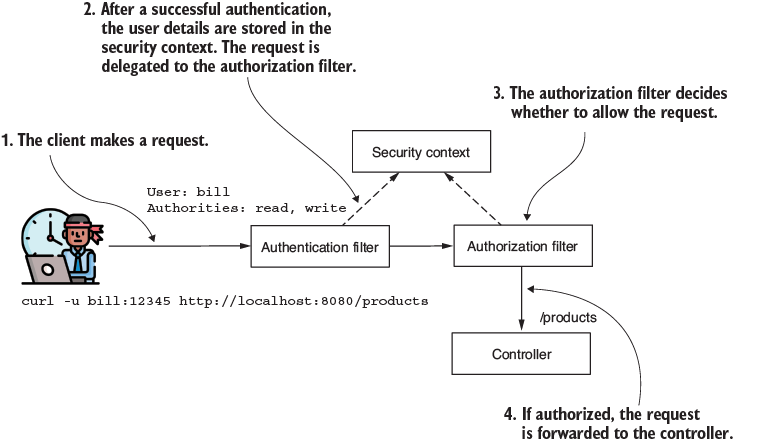

# Autorización

Una vez la aplicación determina tu identidad, viene la parte crucial de decidir si cuentas con los permisos para hacer ciertas acciones. Esta etapa es importante, dado que una mala configuración puede comprometer la integridad y la privacidad de la información de todos los usuarios de una aplicación.

En Spring Security, una vez finaliza el flujo de autenticación, se delega el request al filtro de autorización, como se aprecia en la Figura 1. 



Figura 1. Flujo de autorización. __Fuente:__ Spilca, L. _"Spring Security in Action"_. Second Edition. O'Reilley.

## 1. Restricción de acceso basado en autoridades y roles

Estos conceptos son necesarios para limitar el acceso a las APIs de una aplicación. Los usuarios pueden realizar acciones específicas dependiendo de los privilegios que tengan los usuarios. La aplicación provee estos privilegios en forma de autoridades y roles.

En el capítulo 2.1 (sección de [Autenticación](./auth.md)), implementamos la interfaz de `GrantedAuthority` para la definición de nuestors usuarios a través del `UserDetails`. Sin embargo, no habíamos entrado en los detalles de estas integraciones, como sí lo haremos en la presente sección. Esta relación se puede apreciar en la Figura 2.


Figura 2. Relación entre `UserDetails` y `GrantedAuthority`. __Fuente:__ Spilca, L. _"Spring Security in Action"_. Second Edition. O'Reilley.

Dentro de Spring Security, un _authority_ se concibe como una acción que puede ejecutar un usuario dentro de un recurso. Este _authority_ tiene un nombre, en formato `String`, que se puede obtener al llamar el método `getAuthority()`. Este nombre lo usamos para definir una regla de autorización, como por ejemplo: "Juan tiene permitido _eliminar_ un producto", o "Carolina puede _leer_ los documentos de auditoría". En estos casos, _"leer"_ y _"eliminar"_ son los `GrantedAuthority` definidos para Juan y Carolina. Los detalles de este contrato se pueden apreciar a continuación.

```java
public interface GrantedAuthority extends Serializable {
  String getAuthority();
}
```

### 1.1. Restricciones por autoridades

Como se observa en la Figura 2, cada usuario puede tener una o más autorizaciones de tipo `GrantedAuthority`. Con ellas, podemos limitar el acceso a los endpoints de la aplicación y contamos con tres métodos para hacerlo:

* `hasAuthority()`: recibe como parámetro una sola autoridad para que la aplicación configure la restricción. Sólo los usuarios con esa autoridad pueden acceder al endpoint.
* `hasAnyAuthority()`: puede recibir más de una autoridad para configurar la restricción. El usuario debe tener, al menos, una autoridad para que el request sea aceptado. 
* `access()`: ofrece ilimitadas posibildades para configurar el acceso, debido a que la aplicación define las reglas de autorización basados en un contrato de tipo `AuthorizationManager`. Es posible definir implementaciones customizables. Sin embargo, Spring Security provee algunas implementaciones genéricas, como el `WebExpressionAuthorizationManager`, que ayuda a aplicar reglas de autorización basadas en __Spring Expression Language (SpEL)__. Sin embargo, esta funcionalidad puede complejizar el algoritmo, por lo que no se recomienda para casos de uso sencillos.

Estas reglas pueden aplicarse dentro de la cadena de [Filtros de seguridad](./filtros.md) de nuestro proyecto, dentro del método `authorizeHttpRequests()`. A continuación, se exponen ejemplos de uso para cada uno de estos métodos.

import Tabs from '@theme/Tabs';
import TabItem from '@theme/TabItem';

<Tabs>
<TabItem value="all" label="permitAll()" default>

```java
@Configuration
public class SecurityConfig {

  @Bean
  public SecurityFilterChain securityFilterChain(HttpSecurity http) 
    throws Exception {
    
    http.httpBasic(Customizer.withDefaults());
        
    http.authorizeHttpRequests(
        c -> c.anyRequest().permitAll()    
    );                                     ①

    return http.build();
  }
}
```

`permitAll()` permite el acceso a todos los usuarios autenticados, independientemente de sus autorizaciones asignadas. A su vez, el método `anyRequest()` establece que las reglas aplican para todas las rutas del microservicio.
</TabItem>
<TabItem value="hasAuth" label="hasAuthority()" default>

```java
@Configuration
public class ProjectConfig {

  @Bean
  public SecurityFilterChain securityFilterChain(HttpSecurity http) 
    throws Exception {
    
    http.httpBasic(Customizer.withDefaults());

    http.authorizeHttpRequests(
        c -> c.anyRequest()
          .hasAuthority("WRITE")    
    );                             ①

    return http.build();
  }
}
```

En este caso, se define que sólo los usuarios con un `GrantedAuthority` de tipo __"WRITE"__ tienen acceso a todos los recursos del microservicio.

</TabItem>

<TabItem value="hasAny" label="hasAnyAuthority()">

```java
@Configuration
public class ProjectConfig {

  @Bean
  public SecurityFilterChain securityFilterChain(HttpSecurity http) 
    throws Exception {
    
    http.httpBasic(Customizer.withDefaults());

    http.authorizeHttpRequests(
       c -> c.anyRequest()
            .hasAnyAuthority("WRITE", "READ");     
    );  
                                        ①
    return http.build();
  }
}
```

En este caso, cualquier usuario que tenga alguna de las autorizaciones __"WRITE"__ o __"READ"__ puede acceder a todas las APIs del microservicio.

</TabItem>
<TabItem value="access" label="access()">

```java
@Configuration
public class ProjectConfig {

  @Bean
  public SecurityFilterChain securityFilterChain(HttpSecurity http) 
    throws Exception {
    
    http.httpBasic(Customizer.withDefaults());

    String expression = 
           """hasAuthority('read') and          ①
            !hasAuthority('delete')             ①
           """;                                 ①

    http.authorizeHttpRequests(
      c -> c.anyRequest()
               .access(new WebExpressionAuthorizationManager(expression));

    );                                  

    return http.build();
  }
}
```

El método `access()` permite establecer customizaciones. En este ejemplo, se define que sólo los usuarios con la autorización `read` __sin__ la autorización `delete` tienen acceso a todas las APIs del microservicio. La variable `expression` contiene el algoritmo en __SpEL__.
</TabItem>
</Tabs>

### 1.2. Restricciones por roles

De forma similar a la definida en la sección 1.1, es posible restringir el acceso a endpoints basados en roles. Los roles son otra forma de referirse a los permisos que tiene un usuario sobre las aplicaciones. Como se aprecia en la Figura 3, un rol tiene una serie de autoridades y se puede asignar a múltiples usuarios.


Figura 3. Ejemplos de roles. __Fuente:__ Spilca, L. _"Spring Security in Action"_. Second Edition. O'Reilley.

Spring Security entiende las _autoridades_ como privilegios granulares a los que aplicar restricciones. Mientras que los _roles_ son como "medallas" para los usuarios que ofrecen privilegios sobre un grupo de acciones. La definición de roles también se hace a través de `GrantedAuthority`, con la diferencia de que debe empezar con el prefijo `ROLE_`. En el nivel de implementación, este prefijo especifica la diferencia entre _rol_ y _autoridad_. 

El prefijo se utiliza durante la creación del usuario, por ejemplo:

```java
@Configuration
public class ProjectConfig {

  @Bean
  public UserDetailsService userDetailsService() {
    var manager = new InMemoryUserDetailsManager();

    var user1 = User.withUsername("john")
                    .password("12345")
                    .authorities("ROLE_ADMIN")       ①
                    .build();
    
    var user2 = User.withUsername("jane")
                    .password("12345")
                    .roles("MANAGER")                ①
                    .build();

    manager.createUser(user1);
    manager.createUser(user2);

    return manager;
  }
}
```

① se establece el `ROLE_ADMIN` para `john` y el rol `MANAGER` para `jane`, con `authorities()` y `roles()`, respectivamente.

De forma similar, las restricciones vistas en la sección 1.1 también se pueden replicar para los roles, a través de los métodos: `hasRole()`, `hasAnyRole()` y `access()`.

## 2. Configuración de autorización a nivel de endpoint

En el primer capítulo, entendimos el concepto de aplicar restricciones mediante autoridades y roles. Sin embargo, no todos los roles o autoridades deberían permitir el acceso a todas las rutas. Aprenderemos a limitar las configuraciones de autorización mediante el método `requestMatchers()`.

### 2.1. Uso de `requestMatchers()` para seleccionar endpoints

Dentro de la cadena de filtros de seguridad, podemos especificar los _path_ que deseamos restringir y definir los roles de los usuarios que pueden tener acceso. Por ejemplo: 

```java
@Configuration
public class ProjectConfig {

    @Bean
    public SecurityFilterChain securityFilterChain(HttpSecurity http) 
        throws Exception {

        http.httpBasic(Customizer.withDefaults());

        http.authorizeHttpRequests(
            c -> c.requestMatchers("/hello").hasRole("ADMIN")        ①
                  .requestMatchers("/ciao").hasRole("MANAGER")       ②
        );
            
        return http.build();
    }
}
```

1. Sólo los usuarios con rol `ADMIN` pueden acceder a las rutas con path `/hello`.
2. Sólo los usuarios con rol `MANAGER` pueden acceder a las rutas con path `/ciao`.

Existen diferentes formas de limitar las autorizaciones en la cadena de filtros de seguridad. Algunas de las más frecuentes se pueden observar en la Tabla 1.

| __Expresión__ | __Desripción__ |
| ------------- | -------------- |
| `/a`          | Aplica únicamente para el path `/a` |
| `/a/*`        | El operador `*` reemplaza un pathname. Es decir, aplica para casos como `/a/b`o `/a/c`, pero no para `/a/b/c` |
| `/a/**`       | El operador reemplaza múltiples pathnames. Por ejemplo: `/a`, `/a/b` o `/a/b/c` |
| `/a/{param}`  | Esta expresión aplica para el path `/a`con un parámetro dado |
| `/a/{param:regex}` | Aplica para el path `/a` con un parámetro dado, aceptando sólo valores para el parámetro dados en un expresión regular. Por ejemplo, si se quisiera que el parámetro sólo aceptara número del 1 al 9: `/a/{param:^[1-9]*$}` |

Tabla 1. Definición de rutas para protocolos de autorización en la cadena de filtros.

### 2.2. Expresiones regulares con `requestMatchers()`

Para aprender sobre este tema más en detalle, se recomienda leer en detalle los libros de la siguiente URL: [https://www.regular-expressions.info/books.html](https://www.regular-expressions.info/books.html). También se pueden usar herramientas online como: [https://regexr.com](https://regexr.com).

Se pueden emplear expresiones regulares (_regex_, por sus siglas en inglés) para representar un string en cualquier formato.

## 3. Implementación de autorizaciones al nivel de métodos

