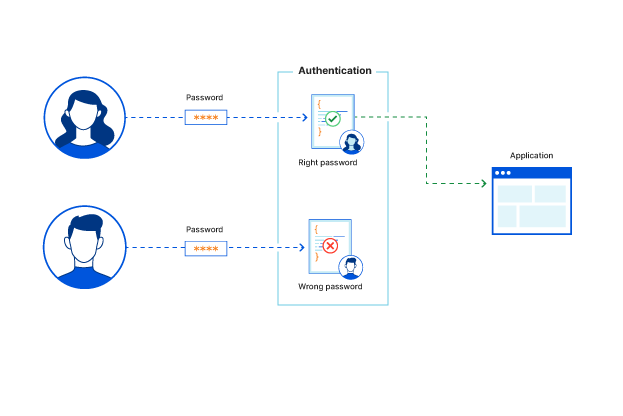
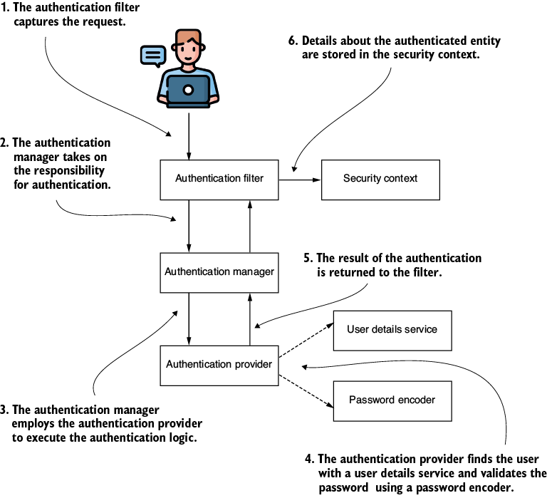
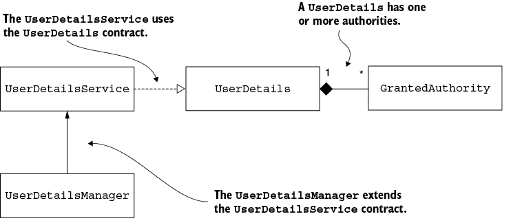

# Conceptos básicos

En su forma más elemental, Spring Security funciona como un filtro. El microservicio recibe las credenciales de un usuario, valida si son correctas, ya sea contra en una base de datos, un caché o contra un servicio de autenticación externo. Luego, revisa si el usuario tiene los permisos para realizar la acción que solicita y, de tenerlos, permite continuar con el flujo lógico de negocio. Si no los tiene, o las credenciales (usuario/contraseña) no son válidas, deniega el acceso. Lo anterior, se puede apreciar de forma gráfica en la Figura 1.



Figura 1. Lógica de autenticación. __Fuente:__ [Cloudflare](https://www.cloudflare.com/learning/access-management/what-is-authentication/)

En el presente capítulo, aprenderemos sobre cómo se establecen estas configuraciones y la metodología básica de trabajo en Spring Security tomando como ejemplo el protocolo de __basic authentication__.

## 1. Protocolo de Autenticación

El proceso de autenticación se divide en dos secciones principales: manejo de _usuarios_ y de _contraseñas_. A continuación, podremos observar la configuración base definida en un proyecto con Spring Security.



Figura 2. Flujo básico funcional con Spring Security. __Fuente:__ Spilca, L. _"Spring Security in Action"_. Second Edition. O'Reilley.

Como se aprecia en la Figura 2, el proceso inicia con el _request_ de un usuario (en donde se envían sus credenciales). Allí, entran en acción diferentes componentes pre-configurados por Spring Security, cada uno descrito a continuación:

1. El `Authentication Filter` delega el proceso de autenticación al `Authentication Manager` y, basado en su respuesta, configura el _security context_.
2. El `Authentication Manager` usa al `Authentication Provider` para realizar la autenticación. Se emplea de esta forma porque el proveedor de autenticación puede ser interno (creado por nosotros) o externo (por ejemplo: Google, GitHub, etc).
3. Por su lado, el `Authentication Provider` ejecuta la lógica de autenticación.
4. El `User Details Service` obtiene las credenciales del usuario, ya sea desde una base de datos, un caché o un proveedor externo.
5. El `Password Encoder` se encarga de la codificación y/o encriptamiento de la contraseña. Se emplea ya sea para almacenar una contraseña o para desencriptarla.
6. Con el usuario y la contraseña (desencriptada), se procede a realizar la comparación y concluir si el usuario es verídico; acorde a la lógica de autenticación.
7. Una vez validada y aprobada, el _security context_ almacena temporalmente las credenciales para la ejecución de los flujos del negocio; es decir, hasta que la aplicación de la respuesta esperada por el usuario.

Para lograr el proceso de autenticación descrito en la Figura 2, Spring Security requiere que el cliente envíe las credenciales del usuario (username/password) a través del `Authorization` header. En el valor del header, el cliente debe añadir el valor `Basic`, seguido del usuario y contraseña, codificados con `Base64` y separados por `:`. 

### 1.1. Manejo de Usuarios

Iniciaremos nuestro recorrido con el manejo de usuarios. Como se aprecia en la Figura 1, existen diferentes interfaces (contratos) que definen la arquitectura base de autenticación y se pueden apreciar en la Figura 2.



Figura 3. Dependencias base para el manejo de usuarios. __Fuente:__ Spilca, L. _"Spring Security in Action"_. Second Edition. O'Reilley.

A continuación, se explican cada uno de estos contratos.

* __`GrantedAuthority`:__ hace referencia a los roles adoptados por el usuario. Cada uno de ellos puede tener múltiples _permisos_ que definen la forma en cómo interactúa un usuario con la aplicación y qué acciones puede ejecutar. Se explica en detalle en el __capítulo 2__.
* __`UserDetails`:__ define el modelo base de usuarios.
* __`UserDetailsService`:__ especifica la forma en cómo se carga la información de un usuario.
* __`UserDetailsManager`:__ especifica las operaciones de adición, modificación o eliminación de un usuario.


#### 1.1.1 Entendiendo `UserDetails`

Esta interfaz consiste en lo siguiente:

```java
public interface UserDetails extends Serializable {
  String getUsername();                                        ①
  String getPassword();
  Collection<? extends GrantedAuthority> getAuthorities();     ②
  boolean isAccountNonExpired();                               ③
  boolean isAccountNonLocked();
  boolean isCredentialsNonExpired();
  boolean isEnabled();
}
```

1.  Contiene las credenciales del usuario.
2.  Define los roles de nuestros usuarios.
3.  Establece posibles configuraciones que restringen o bloquean al usuario, para evitar problemas de suplantación de identidad en el futuro. Son argumentos opcionales y dependen de la lógica de negocio que se requiere implementar. Si alguno de ellos retorna `false`, el usuario no podrá interactuar con la aplicación y responderá con HTTP 401.

#### 1.1.2. ¿Cómo funciona el `UserDetailsService`?

Este contrato únicamente informa la manera de cargar la información de un usuario mediante `username`, como se aprecia a continuación. 

```java
public interface UserDetailsService {
  public UserDetails loadUserByUsername(String username) 
    throws UsernameNotFoundException;
}
```

Se puede implementar en un servicio para especificar la lógica de carga del usuario, que puede variar si proviene de una base de datos relacional, NoSQL, caché o un microservicio externo.

#### 1.1.3. Implementando `UserDetailsManager`

Como se aprecia en la Figura 3, este contrato __extiende__ las funcionalidades definidas por el `UserDetailsService`. Permite especificar la forma en cómo se crean, actualizan o eliminan usuarios, entre otras funcionalidades. 

```java
public interface UserDetailsManager extends UserDetailsService {
  void createUser(UserDetails user);
  void updateUser(UserDetails user);
  void deleteUser(String username);
  void changePassword(String oldPassword, String newPassword);
  boolean userExists(String username);
}
```

Este contrato se puede implementar en otro servicio customizado que especifique las funcionalidades de estos métodos para garantizar la persistencia de los datos.

### 1.2. Manejo de Contraseñas

El manejo de contraseñas es una parte esencial dentro del flujo de autenticación. En la presente sección, hablaremos del contrato de `PasswordEncoder` y las herramientas ofrecidas en el módulo de Spring Security Crypto (SSCM). 

## 2. Protocolo de Autorización

### 2.1. Permisos

### 2.2. Role-Based Access Control - RBAC

