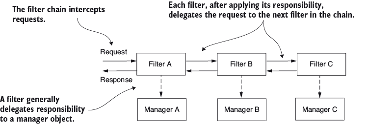
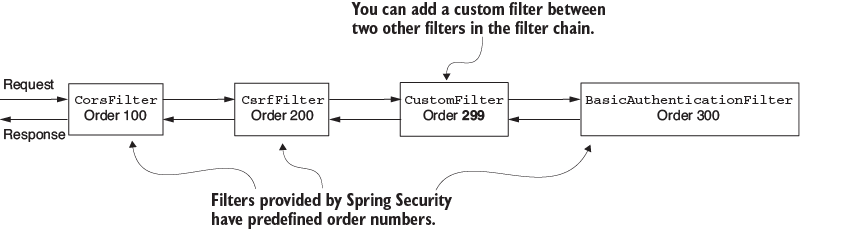
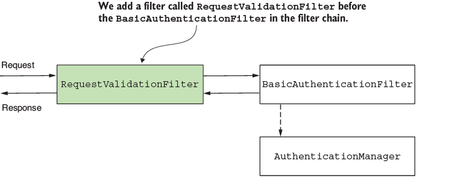
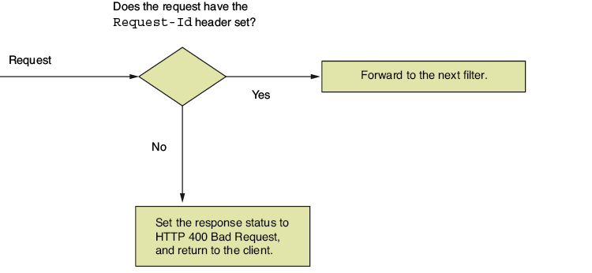
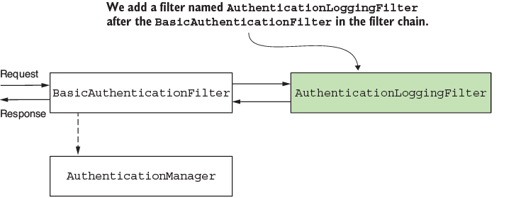

# Filtros de seguridad

Además del protocolo de autenticación, que es uno de los principales filtros definidos en Spring Security, también es posible habilitar otros filtros customizables que permiten realizar validaciones de seguridad durante la comunicación entre microservicios, alterando los _request_ y _response_ de las peticiones acorde a las necesidades del negocio, como se aprecia en la Figura 1.

Figura 1. Concepto de filtros en Spring Security. __Fuente:__ Spilca, L. _"Spring Security in Action"_. Second Edition. O'Reilley.

Conocer cómo manejar los filtros de seguridad es una habilidad valiosa. En la práctica, las aplicaciones presentan requerimientos específicos donde las configuraciones por default de Spring Security son inservibles. Es necesario añadir o reemplazar componentes existentes en la cadena; por lo que es bastante útil en casos donde se desee hacer monitoreo de los microservicios impactados durante un flujo de negocio, procesos de auditoría, arquitecturas orientadas a eventos o notificación a servicios externos, entre otras situaciones. Sea cual sea el escenario, Spring Security permite la customización de la cadena de filtros de manera precisa. 

## 1. ¿Cómo funciona la cadena de filtros?

Los filtros en la arquitectura de Spring Security son típocos filtros HTTP. Podemos crear filtros al implementar la interfaz `Filter` y sobreescribiendo el método `doFilter()`, que recibe los métodos: 

* `ServletRequest`: representa el _request_ de HTTP. Se emplea para obtener los detalles de la petición del usuario.
* `ServletResponse`: representa el _response_ HTTP. Permite alterar la respuesta de una petición antes de reenviarla al cliente.
* `FilterChain`: representa la cadena de filtros. Se emplea para enviar el request y continuar el proceso definido en la cadena de filtros.

La _cadena de filtros_ representa una colección de filtros representa una serie de filtros, con un orden definido, que actúan para procesar y validar las peticiones de un microservicio. Además de la interfaz `Filter`, existen otros tipos de filtros, entre ellos:

* `BasicAuthenticationFilter`: se encarga de ejecutar el proceso de autenticación básica HTTP.
* `CsrfFilter`: se encarga de la [protección CSRF](./csrf.md).
* `CorsFilter`: procesa la [autorización por CORS](./cors.md).

## 2. Adición de filtros en la cadena

En Spring Security, es posible definir el orden de ejecución de cada uno de los filtros en la cadena, como se muestra en la Figura 2.

Figura 2. Adición de filtros custom en la cadena de filtros. __Fuente:__ Spilca, L. _"Spring Security in Action"_. Second Edition. O'Reilley.

A continuación, se expondrán diferentes situaciones para la creación de filtros en diferentes secciones de la cadena. Para facilitar su comprensión, cada una de ellas manejará diferentes escenarios prácticos, que podremos construir con base en las instrucciones del [Taller 7](./talleres/taller7.md). 

### 2.1. Adición de un filtro antes de otro existente

Para entender la implementación de un _filtro custom_, consideremos el siguiente escenario. Supongamos que, por cuestiones de auditoría, debemos asegurarnos que cada petición tenga un header llamado `Request-Id`. De forma simultánea, necesitamos validar este id antes de ejecutar la autenticación. El proceso de autenticación podría requerir la ejecución de querys en una base de datos u otros recursos que no son requeridos llamar si la petición no es válida. Para solucionar este inconveniente, ejecutamos dos pasos:

1. Implementamos el filtro de clase `RequestValidationFilter`, que valida la existencia del header en el request.
2. Añadimos el filtro en la cadena, usando el bean de Spring Security: `SecurityFilterChain`.

Figura 3. Definición de un nuevo filtro. __Fuente:__ Spilca, L. _"Spring Security in Action"_. Second Edition. O'Reilley.

Como se explicón anteriormente, este filtro sólo desea validar la existencia de un header específico. Si existe, continuará al siguiente filtro. Si no, deberá fallar con `HTTP 400`, como se aprecia en la Figura 4.

Figura 4. Lógica del filtro. __Fuente:__ Spilca, L. _"Spring Security in Action"_. Second Edition. O'Reilley.

### 2.2. Adición de un filtro después de otro existente

Este enfoque se emplea cuando se desea crear un nuevo filtro para ejecutarse inmediatamente después que otro ya existente. Supongamos que se requiere ejecutar una lógica después del proceso de autenticación. Ejemplos de esto puede ser el de notificar a diferentes sistemas sobre eventos de autenticación o hacer seguiemiento en procesos de _logging_ y _tracing_. 

Para nuestro ejemplo, imprimeros todos los eventos de autenticación exitosa al añadir un filtro que se ejecute después del filtro de autenticación, como se aprecia en la Figura 5.

Figura 5. Filtro después de la autenticación. __Fuente:__ Spilca, L. _"Spring Security in Action"_. Second Edition. O'Reilley.

La diferencia principal entre la adición de este filtro a la cadena con la sección 2.1 es el uso del método `addFilterAfter()`. Si deseas conocer más a fondo los detalles técnicos, ve al [Taller 7](./talleres/taller7.md).

### 2.3. Adición de un filtro en la misma posición de otro existente

Se emplea en escenarios donde se desea realizar una implementación diferente a otra ya existente. Por ejemplo, cuando se desea cambiar el protocolo de autenticación básica predefinida en Spring Security por otra. Algunos escenarios de este tipo que se pueden encontrar en la vida real son:

* Autenticación basada en un _static header_.
* Uso de una llave simétrica para firmar un _request_ autenticado.
* Uso de una contraseña única de un solo uso (_One-Time Password_ - OTP) para la validar la autenticación durante la comunicación entre microservicios.

