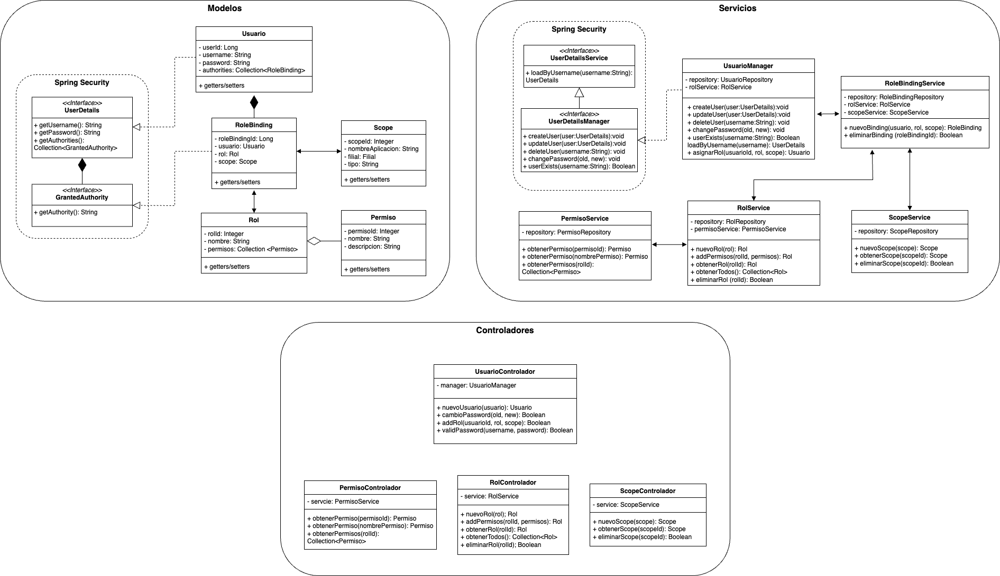

# Tarea 3 - RBAC

El objetivo de la presente actividad es la de construir un microservicio de autenticación que emplee el protocolo [RBAC (_"Role-Based Access Control"_)](https://www.redhat.com/es/topics/security/what-is-role-based-access-control). La arquitectura del microservcio se puede apreciar en la Figura 1.

Figura 1. Arquitectura de la aplicación.

Como se aprecia en la Figura 1, Spring Security no soporta el protocolo RBAC de forma directa, pero podemos basarnos en este framework para construir la lógica del microservicio. En la capa de modelos, podemos reusar los contratos de `UserDetails` y `GrantedAuthority` para definir la lógica de persistencia de usuarios, roles y permisos en una base de datos. De forma similar, en la capa de servicios, reusamos el contrato de `UserDetailsManager` para definir las operaciones CRUD de los usuarios.

## 1. Solución

Este ejercicio es retador, y se recomienda intentar resolverlo solo/a para tener la mejor experiencia de aprendizaje. El microservicio está resuelto y publicado en el siguiente repositorio: [https://github.com/jdarguello/auth-server](https://github.com/jdarguello/auth-server).