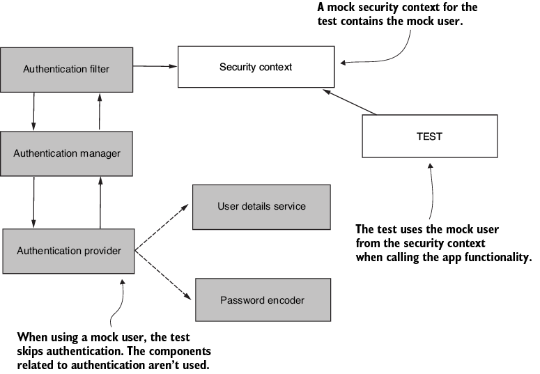

# Testing

En las secciones anteriores, logramos comprender la implementación de la capa de seguridad dentro de nuestros microservicios. Ahora, veremos cómo establecer test unitarios y de integración que permitan concluir un correcto funcionamiento de los protocolos de autenticación, autorización y filtros de seguridad. 

## 1. Usuarios mock

Es una práctica común el hecho de saltar el protocolo de autenticación durante el desarrollo de test unitarios y, en su lugar, enfocarse en la autorización. Recordemos que la autenticación y la autorización dependen una de otra, pero están completamente desacopladas dentro del `SecurityContext`, por lo que, dentro de un set de test unitarios o de integración, podemos reemplazar la configuración base del _security context_ y simularla con credenciales mock para evitar el protocolo de autenticación, como se aprecia en la Figura 1.



Figura 1. Manejo de credenciales de usuarios mock. __Fuente:__ Spilca, L. _"Spring Security in Action"_. Second Edition. O'Reilley.

Como se especificó en el capítulo de [testing](../testing/integracion.md), implementar `SpringBootTest` cargará todos los beans de configuración del microservicio, incluida la capa de seguridad. Por ejemplo, si tuviéramos un controlador simple (tipo "Hola Mundo!"), como el siguiente:

```java
@RestController
@RequestMapping("/api/saludo")
public class SaludarController {

    @GetMapping
    public String saludar() {
        return "Hola!";
    }
    
}
```

E implementaramos el siguiente test unitario:

```java
@SpringBootTest
@AutoConfigureMockMvc
public class MainTests {

  @Autowired
  private MockMvc mvc;

  @Test
  public void helloUnauthenticated() throws Exception {
    mvc.perform(get("/api/saludo"))                            
         .andExpect(status().isUnauthorized()); 
  }

}
```

Nos respondería con un error HTTP 401, dado que el test solicita las credenciales de autenticación del usuario. Para sortear esta situación, es posible implementar la anotación `@WithMockUser`, que configura Spring Boot para levantar un `SecurityContext` que contenga un `UserDetails` determinado. Dicho de otra forma, se salta el protocolo de autenticación. Por ejemplo:

```java
@SpringBootTest
@AutoConfigureMockMvc
public class MainTests {

  @Autowired
  private MockMvc mvc;

  @Test 
  @WithMockUser                                         
  public void helloAuthenticated() throws Exception {
    mvc.perform(get("/api/saludo"))                         
         .andExpect(content().string("Hola!"))
         .andExpect(status().isOk());
  }

}
```

Con esta implementación, la respuesta será ahora HTTP 200 (OK). Sin embargo, en algunas ocasiones, necesitamos probar configuraciones con usuarios que tengan ciertas autoridades/roles para analizar el comportamiento de la cadena de filtros o el filtro de autorización, propiamente hablando. En etsas situaciones, es posible especificar el usuario de la siguiente forma: `@WithMockUser(username = "johana")`. De esta manera, Spring Boot utiliza el `AuthenticationProvider` para cargar la información del usuario "johana" dentro del `SecurityContext` de forma automática; definiendo, en caso de especificarse, sus autoridades y roles. Por ejemplo:

```java
@SpringBootTest
@AutoConfigureMockMvc
public class MainTests {

  @Autowired
  private MockMvc mvc;

  @Test 
  @WithMockUser(username = "johana", authorities = "read")                                         
  public void helloAuthenticated() throws Exception {
    mvc.perform(get("/api/saludo"))                         
         .andExpect(content().string("Hola!"))
         .andExpect(status().isOk());
  }

}
```

## 2. Persistencia de usuarios

En algunas situaciones, es probable que necesitemos corroborar la lógica de obtención de credenciales de los usuarios detrás de una base de datos, un caché o de un servicio de autenticación externa. La lógica donde se implementa esta lógica es en el `UserDetailsService`, a través del método `loadByUsername()`, como se explicó en la secciónd de [Autenticación](./auth.md). Para usar un usuario cuyas credenciales se encuentren almacenadas en una base de datos, utilizamos el decorador __`@WithUserDetails`__. Por ejemplo, para un usuario con `username = johana`, sería:

```java
@SpringBootTest
@AutoConfigureMockMvc
public class MainTests {

  @Autowired
  private MockMvc mvc;

  @Test 
  @WithUserDetails(username = "johana")                                         
  public void helloAuthenticated() throws Exception {
    mvc.perform(get("/api/saludo"))                         
         .andExpect(content().string("Hola!"))
         .andExpect(status().isOk());
  }

}
```

## 3. Protocolo de autenticación

En los capítulos anteriores, centramos la estrategia de testing en el protocolo de autorización. También es posible probar la lógica de autenticación en flujos de integración. El testing es directo, sólo necesitamos las credenciales del usuario que queremos probar. Por ejemplo: `username = johana` y `password = 1234`. 

```java
@SpringBootTest
@AutoConfigureMockMvc
public class AuthenticationTests {

  @Autowired
  private MockMvc mvc;

  @Test
  public void AutenticacionCredencialesValidas() throws Exception {
    mvc.perform(
       get("/hola")
         .with(httpBasic("johana","1234")))          
         .andExpect(status().isOk());
  }

  @Test
  public void AutenticacionCredencialesFalsas() throws Exception {
    mvc.perform(
       get("/hola")
         .with(httpBasic("johana","aeiou")))          
         .andExpect(status().isUnauthorized());
  }
}
```


