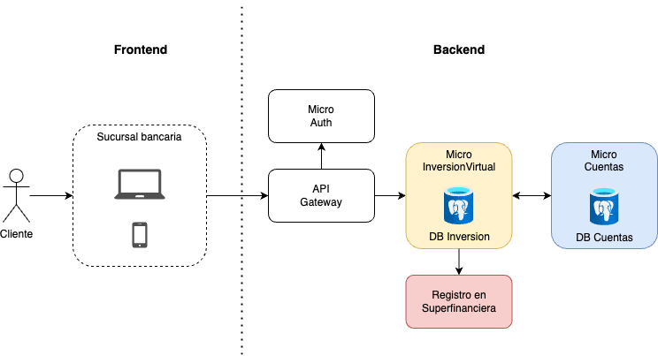

# Test de Integración

A diferencia de los _test unitarios_, los test de integración buscan evaluar los flujos de trabajo completos, donde se ejecutan las interacciones entre los diferentes componentes de software. Estas interacciones pueden ser entre clases dentro de un mismo microservicio o APIs de _"servicios externos"_.

Para el caso de un microservicio de Spring Boot, sólo debemos implementar el bean `@SpringBootTest`. Con él, el test cargará todos los beans pre-configurados; emulando el comportamiento normal de la aplicación. 

## 1. Configuración de diferentes ambientes de trabajo

Dentro del `application.yaml` es sencillo establecer configuraciones para distintos ambientes de trabajo (`spring.profiles`). También es posible establecer configuraciones generales que sean aplicables a todos los ambientes. En el siguiente ejemplo, se tienen dos ambientes: `test` y `dev`, expuestos en el puerto `8080`. La primera con base de datos en memoria, tipo H2, y la segunda con base de datos MySQL.

```yaml
server:
    port: 8080

---
spring:
  profiles: test
  datasource:
    url: jdbc:h2:mem:test-db
    username: test-user
    password: test-pass

---
spring:
  profiles: dev
  datasource:
    url: jdbc:mysql://localhost:3306/dev-db
    username: dev-user
    password: dev-pass

```

## 2. Docker Compose y Testcontainers

Docker Compose es una herramienta de orquestación de contenedores básica que se puede acoplar fácilmente con el entorno de desarrollo de Spring Boot, a través de la dependencia de _Docker Compose Support_, como se puede apreciar en la Figura 1.


Figura 1. Dependencias de _Docker Compose_ y _Testcontainers_ en Spring Initialzr.

Al utilizar Docker Compose, la estructura del proyecto habilita la carpeta `compose.yaml`, en donde se pueden especificar los diferentes contenedores con los que se desea trabajar, como se muestra a continuación.

import Tabs from '@theme/Tabs';
import TabItem from '@theme/TabItem';

<Tabs>
    <TabItem value="folder" label="Estructura del proyecto" default>
    ```bash
    /my_microservice
    ├── /src
    │   ├── /main
    |   |   ├── /java
    |   |   |   ├── /Group-name/Artifact/Name
    |   |   |   ├── {{Name}}Application.java
    |   |   ├── /resources
    |   |   |   ├── /static
    |   |   |   ├── /templates
    |   |   |   ├── application.properties
    │   ├── /test
    ├── build.gradle
    ├── settings.gradle
    ├── compose.yaml
    ```
    </TabItem>
    <TabItem value="yaml" label="Docker Compose YAML">
    En el archivo YAML es fácil e intuitiva la orquestación de contenedores. Simplemente se debe darle un nombre al servicio, al contenedor (`container_name`), especificar la imagen (`image`) y variables de entorno (`environment`), entre otros. Por ejemplo, a continuación, se puede ver la configuración base para crear una base de datos en PostgreSQL.
    ```yaml
    services:
        postgres:
            container_name: blog_postgres_db
            image: 'postgres:latest'
            environment:
            - 'POSTGRES_DB=blog'
            - 'POSTGRES_PASSWORD=secret_password'
            - 'POSTGRES_USER=blog'
            ports:
            - '5432'
    ```
    </TabItem>
</Tabs>

Por otro lado, la dependencia de `Testcontainers` se trata de una librería base de Spring Framework que facilita la implementación de contenedores dentro de los test de integración en Spring Boot. Es especialmente útil para realizar pruebas de integración automática con bases de datos contenerizados. 

### 2.1. ¿Cuándo usar uno u otro?


Depende del caso de uso. Para pruebas de flujo interno, lo más probable es que se requieran desarrollar pruebas aisladas y controladas con bases de datos, por lo que el uso de `Testcontainers` podría ser suficiente. En otros casos, se podría requerir el uso de pruebas con otros microservicios para comprobar la funcionalidad de flujos completos; en cuyo caso podría ser recomendable utilizar esta herramienta en conjunto con `Docker Compose`. 

En la Tabla 1 se encuentran algunas consideraciones que podrían ayudar a seleccionar una u otra. __Recuerda que pueden existir casos donde sea viable usar ambas__.

| __Criterio__ | __Docker Compose__ | __Testcontainers__ |
| ------------ | ------------------ | ------------------ |
| Ambientes con múltiples servicios (contenedores) | Comportamiento predefinido. Especial para este tipo de situaciones. | Requiere múltiples configuraciones en Java puro. Opción menos recomendada. |
| Aislamiento y repetitividad del test | Contenedores no aislados. Los servicios persisten en cada test. | Contenedores completamente aislados y creados por cada test. |
| Configuración dinámica | Limitada. Sólo se define a través del `compose.yaml` | Completamente dinámica. Definida mediante programación. |
| Portabilidad | Requiere que esté instalado Docker Compose. | Trabaja siempre que Docker esté instalado. |
| CI/CD | Ideal para ambientes compartidos que requieren persistencia de datos. | Ideal para ambientes de pruebas aisladas. |


## 3. Pruebas de flujo interno

En este tipo de pruebas, se busca evaluar los flujos completos de __un solo microservicio__. Busca evaluar la lógica de las integraciones en las capas de _modelos_, _servicios_ y _controladores_. Para ello, implementamos `@SpringBootTest` y los beans de `Testcontainers` para la persistencia de datos. Este tipo de pruebas se ejecutan en la capa de __controladores__, por ejemplo:

```java
@Testcontainers
@SpringBootTest(webEnvironment = SpringBootTest.WebEnvironment.RANDOM_PORT)
@Transactional
class ControllerIntegrationTest {

    @Container
    @ServiceConnection
    static PostgreSQLContainer<?> postgres = new PostgreSQLContainer<>("postgres:latest");

    @Autowired
    TestRestTemplate restTemplate;

    @Test
    void connectionEstablished() {
        assertThat(postgres.isCreated()).isTrue();
        assertThat(postgres.isRunning()).isTrue();
    }

    @Test
    void shouldFindAllPosts() {
        Post[] posts = restTemplate.getForObject("/api/posts", Post[].class);
        assertThat(posts.length).isGreaterThan(100);
    }
}
```

Algunos de los beans utilizados se describen a continuación.

* __`@Testcontainers`__: indica que el set de testing utilizará Testcontainers. Maneja el ciclo de vida de los contenedores definidos de forma automática.
* __`@SpringBootTest`__: Inicializa el contexto de la aplicación emulando la aplicación de Spring Boot.
  * `WebEnvironment.RANDOM_PORT`: inicializa el contexto de la aplicación en un puerto aleatorio. Es útil para testear toda la aplicación.
* __`@Transactional`__: asegura que cada test corra en un contexto transaccional, haciendo _rollbacks_ automáticos en cualquier cambio de la base de datos.
* __`@Container`__: marca el `PostgreSQLContainer` como un contenedor manejado por Testcontainer.
* __`@ServiceConnection`__: configuración que conecta la aplicación con la base de datos PostgreSQL de forma automática.

## 4. Integración con otros microservicios

La estrategia de testing para evaluar la integración con otros microservicios depende de la robustez de la estrategia organizacional. Si estamos trabajando con un grupo de microservicios contenerizados y versionados, entonces podemos implementar _Docker Compose_ y `Testcontainers` en nuestros test de integración. Si, por el contrario, estamos construyendo un microservicio que se integrará con monolitos legados, microservicios no contenerizados o servicios externos a nuestro ecosistema, lo recomendable sería trabajarlo con `WireMock` para simular la lógica de integración.

### 4.1. Integración con microservicios de la misma organización

Para los casos en donde los microservicios a integrar son de la misma organización y están contenerizados, es viable implementar Testcontainers con Docker Compose. Por ejemplo, suponiendo que el flujo que sigue la solicitud de un cliente para sacar un CDT fuese el expuesto en la Figura 1.



Figura 1. Flujo para generación de CDTs.

Como se aprecia en la Figura 1, un cliente que desea sacar un CDT impacta diferentes microservicios para lograr su objetivo. Sin embargo, no es necesario emular el comportamiento de todos los microservicios, sólo los que interactúan con el que estemos diseñando (para nuestro ejemplo, es el de color amarillo: __Micro de CDTs__). Las pruebas que impactan a todo el flujo se conocen como pruebas E2E (_End-To-End_). El microservicio de CDTs se comunica con dos servicios: el de saldos (interno) y el que realiza el registro a la Superintendencia Financiera como ente regulador (externo). En esta sección, analizaremos la primera integración.

En la integración entre el _Micro de CDTs_ y el _Micro de Saldos_, se observa que cada uno cuenta con una base de datos PostgreSQL. Lo que significa que, si queremos ver la forma en cómo se integra una lógica con la otra, debemos crear, no sólo el contenedor del otro microservicio sino también la de su base de datos. Debido a ello, deberíamos utilizar Docker Compose para facilitar el manejo de estos contenedores, que podría ser algo como lo siguiente:

```yaml
services:
    DB_CDTs:
        container_name: db_cdts
        image: 'postgres:16.0'
        environment:
        - 'POSTGRES_DB=cdts'
        - 'POSTGRES_PASSWORD=secret_password'
        - 'POSTGRES_USER=example'
        ports:
        - '5432'
    DB_Saldos:
        container_name: db_saldos
        image: 'postgres:15.0'
        environment:
        - 'POSTGRES_DB=saldos'
        - 'POSTGRES_PASSWORD=secret_password'
        - 'POSTGRES_USER=example'
        ports:
        - '5432:5431'
    Micro_Saldos:
        container_name: micro_saldos
        image: 'artifactory/micro_saldos:2.1.3'
        environment:
        - 'DB_Name=saldos'
        - 'DB_Password=secret_password'
        - 'DB_User=example'
        - 'DB_Port=5431'
        ports:
        - '8080:8081'
```

De esta forma, tenemos habilitado el microservicio de saldos, con su base de datos de pruebas, para realizar test de integración y pruebas funcionales completas que nos permitan verificar el cumplimiento de los requerimientos funcionales de flujos completos.

### 4.2. Integraciones con software externo

Existen circunstancias en donde debemos conectarnos con microservicios externos sobre los que no tenemos ningún control. Puede que alguno de estos servicios no tengan disponibles ambientes de _sandbox_ para realizar pruebas de integración completas. En estas situaciones, debemos mockear estos servicios externos a través de `WireMock`. 

En el ejemplo de la Figura 1 (sección 4.1), el microservicio de CDTs necesita comunicarse con un microservicio de la Superintendencia Financera para hacer el registro de nuevos CDTs, dando cumplimiento a las regulaciones expuestas por el gobierno nacional. Este microservicio es externo, legado y no cuenta con ambiente sandbox de pruebas. Como es un microservicio oficial, no podemos conectarnos para registrar CDTs falsos, porque sería un delito. Lo que nos obliga a mockear el servicio con las posibles respuestas para corroborar que nuestro microservicio opere de forma adecuada en diferentes circunstancias. A continuación, se expone cómo se podría utilizar `WireMock` en estas situaciones.

```java
@SpringBootTest(webEnvironment = SpringBootTest.WebEnvironment.RANDOM_PORT)
@AutoConfigureMockMvc
public abstract class ExternalIntegrationTest {
    private static final int WIREMOCK_PORT = 8180;
    private static WireMockServer wireMockServer;

    @BeforeAll
    public static void setUp() {
        startWireMockServer();
    }

    private static void startWireMockServer() {
        wireMockServer = new WireMockServer(wireMockConfig().port(WIREMOCK_PORT));
        wireMockServer.start();
        configureFor("localhost", WIREMOCK_PORT);
        stubForOpenIDConfiguration();
    }

    @AfterAll
    public static void tearDown() {
        if (wireMockServer != null && wireMockServer.isRunning()) {
            wireMockServer.stop();
        }
    }
}
```

Para utilizar `WireMock` se requiere 


