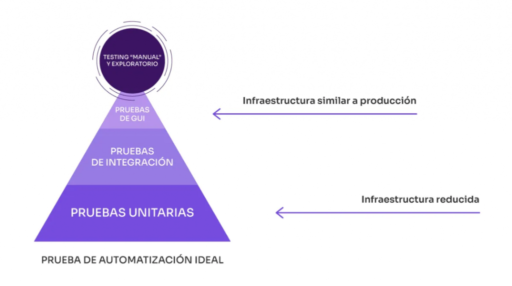

# Introducción

La _calidad_ del código fuente trata de uno de los aspectos más relevantes dentro del ciclo de vida del desarrollo de software. Se trata de la etapa que garantiza la mantenibilidad de los requerimientos funcionales del código fuente en el tiempo. Con ello, se asegura que cuando se produzcan modificaciones o adiciones nuevas en el código, estas no vayan a _"romper"_ lo que ya antes funcionaba. En conjunto con las nuevas arquitecturas de software, __esta es la diferencia principal entre un _software legado_ y un _software moderno___. 

Figura 1. Pirámide de Cohn. Fuente: https://es.abstracta.us/wp-content/uploads/2024/03/infraestructura-pruebas-performance-rendimiento-software-1024x573.png

La pirámide de Cohn cimenta la base del ecosistema de pruebas de un desarrollo de software _ideal_. Las pruebas unitarias garantizan la funcionalidad base, aislada, de los métodos y clases dentro de un microservicio. Seguido, están las _pruebas de integración_, que como su nombre indica, busca evaluar el correcto funcionamiento de dos o más componentes de software; incluye interacción entre clases y servicios externos. Por último, están las pruebas E2E (GUI), que buscan evaluar los flujos operativos de una aplicación web o móvil. __Nos centraremos en pruebas unitarias y de integración__. 

## 1. Pruebas Unitarias: _Coverage_ y TDD

Las pruebas unitarias son parte esencial en la construcción de código de alta calidad. Como se aprecia en la Figura 1, se trata de la base de la pirámide. Buscan garantizar la funcionalidad aislada de las diferentes clases, métodos y funciones construídas en un desarrollo de software.

Como métrica que analiza la adopción de pruebas unitarias en un proyecto de software está la _cobertura de código_. Esta métrica analiza la cantidad de líneas de código que se ejecutan dentro de un algoritmo. Por ejemplo, si un algoritmo está compuesto por 100 líneas de código y los test unitarios ejecutan, en total, 80 líneas, se dice que el set de pruebas cubre el 80% del algoritmo.

El _Test-Driven Developmente_, también conocido como TDD, se trata de una práctica de desarrollo en donde se construyen, primero, el set de pruebas conforme a los requerimientos funcionales del desarrollo y, luego, se redacta el algoritmo que garantice el éxito de las pruebas unitarias. Se trata de una de las principales prácticas de _código limpio_ más efectivas a largo plazo en la mantenibilidad del código fuente.

### 1.1. Mocks

Cuando un método o clase requiere la integración con otros métodos, funciones o servicios externos, se hace imposible probar la lógica con base en los lineamientos convencionales de un test unitario. De aquí, surge el concepto de los _Mocks_, que simulan el comportamiento de los otros componentes de software para lograr aislar efectivamente el método, clase o función que se busca probar.

## 2. Pruebas de integración

A diferencia de la situación en que se emplean Mocks en el código fuente, las pruebas de integración buscan evaluar, dentro de entornos controlados, que las integraciones de diferentes clases, métodos y funciones generen un resultado esperado verificable. Se concibe como el siguiente paso de _testing_, dado que ya no se trata de evaluar lógica aislada, sino de corroborar el comportamiento de los resultados en cadena de diferentes componentes de software. Suele incluir la integración con los servicios externos con los que se comunica un microservicio y su estructura es similar la de un test unitario.

Figura 2. Beneficios de implementar tests de integración. Fuente: https://litslink.com/wp-content/uploads/2023/06/Benefits-of-Integration-Testing.png

## 3. Mutation Testing

Como se comentó anteriormente, la cobertura del código fuente, alcanzada mediante pruebas unitarias, no es en sí mismo un factor concluyente de que el código fuente sea _"de alta calidad"_. Además de la automatización que proveen los LLMs para incrementar los niveles de cobertura, existen diferentes formas prácticas que incrementan esta métrica sin ejecutar las comparaciones necesarias que garanticen las funcionalidades base. 

EL Mutation Testing se trata de pruebas que corroboran la integridad en la estructura de los test unitarios. Altos niveles de cobertura en conjunto con altos estándares en Mutation Testing garantizan la integridad en las pruebas unitarias elaboradas y, en consecuencia, una alta calidad en el código fuente.

El Mutation Testing consiste en hacer cambios controlados sobre el código fuente, de forma automática, verificando que los test uniarios establecidos fallen de forma intencionada; garantizando así la integridad de los test unitarios y de integración. 

## 4. Frameworks

Los frameworks de testing utilizados en el presente trabajo se enumeran a continuación.

| Framework | Versión | Descripción |
| --------- | ------- | ----------- |
| JUnit  | v5.11   | Framework base de Java para la construcción de pruebas unitarias. |
| Mockito    | v5.15  | Emula la interacción entre diferentes componentes de software mediante Mocks en pruebas unitarias. |
| Pitest     | v1.14  | Framework de mutation testing en Java. |

Tabla 1. Resumen de frameworks de testing en Java.