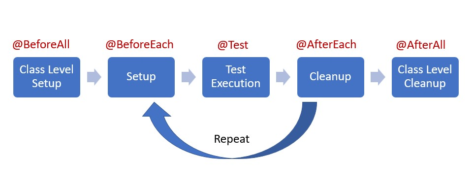

---
sidebar_position: 2
--- 

# Test Unitarios

Un _test unitario_ se concibe como una prueba aislada y controlada en donde se verifica la veracidad de la lógica de un método o clase. Por ejemplo, si tenemos una función de `suma` como la mostrada a continuación.

```java
public class Calculadora {
    public Integer suma(Integer x, Integer y) {
        return x + y;
    }
}
```

Tal vez podamos pensar que, en sí misma, es suficiente para cualquier operación de suma. Pero, la cruda realidad, es que no. ¿Qué pasa si quiero sumar más de dos números?, ¿qué ocurre si, por alguna razón, uno de los valores a sumar es `Null`?, ¿y si necesito que los valores de la suma sólo puedan ser números positivos? Estos y más interrogantes corresponden a los __requerimientos funcionales__ de nuestra función `suma`. 

Para garantizar que nuestra operación de suma cumpla con todos los requerimientos, lo recomendable es aplicar la práctica de _Test-Driven Development_ (TDD), que consiste en construir un set de pruebas que, de aprobarse, garantizarán el cumplimiento de estos requerimientos. Para este ejemplo, podría ser algo como:

```java
@Test
public void sumarMuchosNumeros() {
    Calculadora calculadoraTest = new Calculadora();    //objeto de pruebas

    assertEquals(calculadoraTest.suma(2,5,3,10), 20);    //Suma de pruebas. Debe dar como resultado 20.
    assertEquals(calculadoraTest.suma(2,2,5), 9);       //Suma de pruebas. Debe dar como resultado 9.
}

@Test
public void sumaConNull() {
    Calculadora calculadoraTest = new Calculadora();    //objeto de pruebas

    //Tal vez, requiramos que, si hay un 'Null', lo ignore y sume todo lo que sí deba sumar
    assertEquals(calculadoraTest.suma(1, Null), 1);
    assertEquals(calculadoraTest.suma(1, 2, Null), 3);

    //O, tal vez necesitamos que falle la función, con un mensaje específico
    Exception exception = assertThrows(
        Exception.class,
        () -> calculadoraTest.suma(1, Null),
    );

    assertEquals("No se pueden sumar argumentos 'Null'", exception.getMessage());
}

@Test
public void sumarNegativos() {
    //Si hay algún número negativo, deberá fallar
    Exception exception = assertThrows(
        Exception.class,
        () -> calculadoraTest.suma(1, -2, 3),
    );

    assertEquals("No se permite sumar números negativos", exception.getMessage());
}
```

Como podemos apreciar, se construye un `@Test` unitario por cada requerimiento funcional. __Esto es TDD__. Al reconstruir la función que garantiza estos nuevos requerimientos, quedaría algo como:

```java
public class Calculadora {
    public Integer suma(Integer... numeros) {
        suma = 0;
        for (Integer numero : numeros) {
            if (numero == null) {
                throw new Exception("No se pueden sumar argumentos 'Null'");
            }
            else if (numero < 0) {
                throw new Exception("No se permite sumar números negativos");
            }
            else {
                suma += numero;
            }
        }
        return suma;
    }
}
```

Como podemos ver, los test unitarios permiten que nuestro desarrollo se anteponga ante diferentes situaciones, controlando su comportamiento y dando resultados medibles y esperables. __Cumpliendo con los requerimientos funcionales establecidos__. Además, y lo más importante, es que garantizan su funcionalidad base con el tiempo; de forma que, cuando lleguen nuevos requerimientos, los cambios en el software no rompen las funcionalidades anteriormente definidas, __garantizando la mantenibilidad__. 

## 1. Estructura base

La estructura base de un _test unitario_ consiste en lo siguiente:

import Tabs from '@theme/Tabs';
import TabItem from '@theme/TabItem';

<Tabs>
    <TabItem value="img" label="Estructura general" default>
    
    Figura 1. Estructura general de un test unitario.
    </TabItem>
    <TabItem value="code" label="Estructura Java" default>

```java
public class EstructuraTest {

    // Atributos de configuración
    private static String atributoConfig;

    // Atributos compartidos por test
    private String atributoTest;

    @BeforeAll
    public static void setupClass() {
        // Se emplea para ejecutar lógica de configuración general. Por ejemplo: establecer conexión a una base de datos en memoria (tipo H2)
        System.out.println("Esto se ejecuta UNA SOLA VEZ");
    }

    @BeforeEach
    public void beforeEach() {
        // Se ejecuta antes de cada método de test. Por ejemplo: para reiniciar el contenido de una base de datos.
        System.out.println("Se ejecuta ANTES de cada test");
    }

    @Test
    public void testUnitario() {
        System.out.println("Ejecución del test");
        assertNotNull(sharedResource);              //LÓGICA QUE DEBE CUMPLIR EL TEST
    }

    @AfterEach
    public void afterEach() {
        // Executed after each test method
        System.out.println("Se ejecuta DESPUÉS de cada test");
    }

    @AfterAll
    public static void afterAll() {
        // Executed once after all test methods in the class
        System.out.println("After all tests");
        sharedResource = null; // Clean up shared resource
    }
}

```

</TabItem>
</Tabs>

Como se aprecia en la Figura 1, y en la estructura Java, los test unitarios están compuestos por diferentes secciones, resumidos en la Tabla 1.

| __Sección__ | __Descripción__ | __Ejemplo de uso__ | 
| ----------- | --------------- | ------------------ |
| `@BeforeAll` | Ejecuta lógica al inicio del set de testing. Se ejecuta __una sola vez__. | Establecer conexión a una base de datos en memoria (tipo H2) para emular operaciones de persistencia de datos. |
| `@BeforeEach` | Los test unitarios se ejecutan de forma aleatoria. Deben ser repetibles e aislados. Esta sección permite reiniciar configuraciones y variables generales, y se ejecuta antes de cada test unitario. | Escribir registros en tablas de bases de datos en memoria, que sean empleados en _todos_ los test unitarios. |
| `@Test` | Realiza comparaciones (`assert`) que garantizan el correcto funcionamiento de los requerimientos funcionales. | Cuando se desea verificar la funcionalidad base o en escenarios de fallo controlados. Permite dar manejo a bugs y requerimientos funcionales. |
| `@AfterEach` | Permite reiniciar configuraciones generales. Se ejecuta después de cada test unitario. | Reinicio de los registros en las tablas de una base de datos en pruebas de persistencia. |
| `@AfterAll` | Ejecuta lógica general al finalizar el set de testing, __una sola vez__. | Eliminar la base de datos de pruebas para reiniciar las configuraciones generales en otros set de testing. |

Tabla 1. Secciones de un test unitario.

### 1.1. Tipos de `assert`

El éxito de un test unitario depende del tipo de comparaciones que se realizan. Algunas de las comparaciones principales se pueden apreciar en el ejemplo de una operación de suma (`assertEquals` y `assertThrows`). Existen diferentes tipos de comparaciones, algunos de los más populares se pueden apreciar en la Tabla 2.

| __Tipo__ | __Descripción__ | __Ejemplo__ |
| -------- | --------------- | ----------- |
| `assertEquals` | Realiza una comparación exacta entre dos objetos. Si son iguales, pasará el test. De lo contratio, lo rechazará. | `assertEquals(2,1+1)` |
| `assertTrue` | Verifica que el valor booleno sea `true`. De serlo, pasará el test. | `assertTrue(2 > 1)` |
| `assertFalse` | Comprueba que el valor booleno sea `false`. De serlo, pasará el test. | `assertFalse (2 < 1)` |
| `assertNotNull` | Asegura que el valor no sea de tipo `null`. No se recomienda usarlo como comparativo definitivo de un requerimiento funcional. Debería usarse para verificaciones secundarias. | `assertNotNull("Hola, no soy un 'null'")` |
| `assertThrows` | Verifica que, durante la ejecución de un test, falle de acuerdo a una clase de excepción y con un mensaje de error esperado. | NA |

Tabla 2. Tipos de `assert` más recurrentes.


## 2. Mocks

Existen ocasiones en que la lógica de un método depende de las interacciones con las clases subyacentes a través de relaciones de _asociación_, _agregación_ o _composición_. Como se especificó anteriormente, un test unitario debe ser aislado y repetibe, pero también debe ser __independiente__. Es decir, no debe depender de las interacciones con otros objetos. Con base en ello, nace el concepto de un _Mock_.

Un Mock se trata de un objeto tipo _"cascarón"_ que carece de todo tipo de lógica. Los resultados de los métodos del mock son definidos específicamente dentro del test unitario, permitiendo controlar su comportamiento al ser inyectado dentro del objeto de estudio. Un ejemplo de uso se puede apreciar a continuación.

```java
import static org.mockito.Mockito.*;

public class ExampleMockTest {
    @Test
    public void testWithMock() {
        // Crear el Mock
        MyDependency dependency = mock(MyDependency.class);

        // Usarlo en el test unitario
        when(dependency.getData()).thenReturn("Mocked Data");

        // Comparar el comportamiento
        assertEquals("Mocked Data", dependency.getData());
    }
}
```
